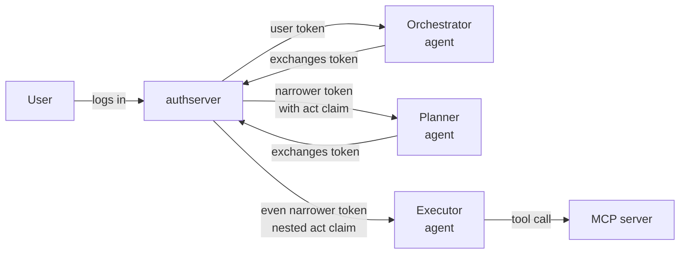

# Delegation and agent chains

*Context: this is part of [Concepts](README.md). Start with the primer if you haven't.*

Most of the time a token represents "this user, calling this resource."
But AI workflows are rarely that simple — an [orchestrator](glossary.md#glossary-agent)
hands off to a planner, which hands off to a tool-executor. Each hop is a
new actor acting on behalf of the original user. **Token exchange** is the
OAuth mechanism (RFC 8693) that lets that handoff happen without ever
re-prompting the user.

## The plain-English version



Each exchange:

1. The current holder presents its access token as `subject_token` at
   `/oauth/token` with `grant_type=urn:ietf:params:oauth:grant-type:token-exchange`.
2. authserver verifies the subject token, checks who's allowed to act for
   the target resource, and mints a new token.
3. The new token's `sub` is still the original user. Its
   [`act` claim](glossary.md#glossary-act-claim) records who performed the
   exchange. Its scope is **never wider** than the subject's.

## Why a separate mechanism

You could imagine just passing the original user token down the chain. Two
reasons we don't:

- **Audience binding.** Each hop is calling a different resource — maybe
  even a different MCP server. The original token's `aud` doesn't match.
- **Accountability.** When something goes wrong, the audit log must answer
  "which agent issued the destructive tool call?" — not just "which user
  authorized this session three hops ago." The `act` claim gives you that
  chain.

## The `act` claim — nested

Each exchange wraps the previous one:

```json
{
  "sub": "user-uuid-v7",
  "client_id": "executor-agent",
  "scope": "mcp:echo",
  "act": {
    "sub": "executor-agent",
    "actor_type": "agent",
    "act": {
      "sub": "planner-agent",
      "actor_type": "agent",
      "act": {
        "sub": "orchestrator",
        "actor_type": "agent"
      }
    }
  }
}
```

**Outermost `act` is the most recent actor.** Per RFC 8693 §4.1 ¶6, only
the **outermost** actor is authoritative for authorization decisions. Inner
hops are informational — useful for audit and display, but your MCP server
MUST NOT make access-control decisions based on them.

`actor_type` is `"agent"` if the acting client has `is_agent: true`,
otherwise `"service"`. authserver stamps it on the new outermost hop only;
inner hops are passed through unchanged.

## The `agent_chain` claim — flat

The nested `act` is technically complete but inconvenient. authserver also
emits a flat, ordered list:

```json
{
  "sub": "user-uuid-v7",
  "agent_id": "executor-agent",
  "agent_chain": [
    "orchestrator",
    "planner-agent",
    "executor-agent"
  ]
}
```

[`agent_chain`](glossary.md#glossary-agent-chain) reads left to right:
first entry is the originator, last entry is the current actor. Same
information as walking the nested `act`, but trivial for the MCP server to
consume:

```go
// Only allow direct agents (no sub-delegation) for sensitive tools
if len(claims.AgentChain) > 1 && isSensitiveTool(toolName) {
    return errors.New("sub-delegated agents cannot call sensitive tools")
}

// Rate limit by the calling agent. Key on agent_id, not agent_chain[0]:
// agent_id is always a registered client id, while a chain entry is not
// always one (see the jwt-bearer caveat below).
rateLimitKey := claims.AgentID
```

### When each claim is present

Both claims live on **Authplane-signed (Mint) tokens**. A token exchange
against a [Broker](broker-vs-mint.md) resource vends the upstream
provider's own credential, which cannot carry Authplane claims — there,
`agent_id` and `agent_chain` are recorded on the issuance row for
forensics rather than on the wire.

On Mint tokens, `agent_id` is present whenever the issuing client is
registered with `is_agent: true`, whatever grant produced it —
`authorization_code`, `refresh_token`, `client_credentials`, token
exchange or `jwt-bearer`.

`agent_chain` is derived from the nested `act` claim, so it appears only on
tokens that carry one. A first-hop token — the agent acting directly, whether
on its own behalf (`client_credentials`) or with the user's consent
(`authorization_code`, and its `refresh_token` rotations) — carries `agent_id`
and **no** `agent_chain`. The chain appears from the first Mint-backed token
exchange onward.

> **Caveat — `jwt-bearer`.** That grant sets `act` on every token to record
> which IdP asserted the user, not to record delegation. For an agent client,
> that provenance `act` still flows into `agent_chain`, so the entry you get is
> the **asserting IdP's issuer URL**, not a `client_id`. Do not treat a
> `jwt-bearer` token's `agent_chain` as a chain of agents, and do not feed
> `agent_chain[0]` from one into a client-id-keyed lookup.

So resource servers should read `agent_id` to answer "is the caller an agent,
and which one", and treat an empty `agent_chain` as "no sub-delegation", never
as "not an agent". Length-check before indexing, and — given the `jwt-bearer`
caveat — do not assume every entry is a registered client id.

Note that the `authplane_agent_identity_supported` flag in the AS metadata
is an **advertisement only**: it tells clients the extension exists, but
turning it off does not stop the claims from being emitted. Agent clients
get `agent_id` either way.

## Chain depth limits

```
With max_chain_depth = 4:
User → Agent A → Agent B → Agent C → Agent D   ✅ allowed (depth 4)
User → Agent A → Agent B → Agent C → Agent D → Agent E   ❌ rejected with chain_too_deep
```

The default is 4. Increase only if you have a real need; deep chains are
hard to audit and reason about. Per Authplane convention, the
`agent_chain` list itself is capped at 8 entries with truncation of the
oldest, but `max_chain_depth` should catch problems earlier.

## Who's allowed to exchange

When a client requests a token exchange against a **registered** resource,
the gates run in sequence — operator allowlist (3 below), subject-scope
ceiling, user consent (skipped for Mint self-exchange and on fronted
paths, Mint→Mint and Mint→Broker alike); see
[Token Exchange grant → Step 3](../guides/upstream-providers/token-exchange-grant.md#step-3-gate-the-resource-with-policyexchangeallowed_client_ids).
When `resource` is omitted (legacy fall-through), only (1) can authorize
the exchange. A cross-client exchange there is refused outright: naming a
resource is what routes the request to the operator gate in (2).

1. **Self-exchange** — `allow_self_exchange: true` AND the requesting
   client's `client_id` matches the subject token's `client_id`. Used for
   scope narrowing (a service that has a broad token wants a narrow one).
2. **Per-resource policy** — the target resource's
   `policy.exchange.allowed_client_ids` includes the acting client. An
   empty list allows any client to exchange a token that was issued to
   *itself*. Delegating another client's token on the direct Mint path is
   different: there the acting client must be named, because the
   consent grant that authorizes the exchange belongs to the subject
   token's client and an operator who never named the delegate never
   authorized it to inherit that grant. Being listed in the target's
   `policy.runtime.client_ids` also satisfies it — that declares the
   caller *is* the target resource, so the token's audience and its
   holder are the same thing the user consented to reach, and there is no
   third party to name. For
   [Broker](glossary.md#glossary-broker-backend) resources, the
   three-bound [consent](glossary.md#glossary-consent) check then runs on
   top; its agent-attestation gate resolves the acting client to a
   resource of its own, so a delegate that no operator registered cannot
   reach it either.

The operator gate (3) and the legacy fall-through (1 and 2) deny with
`access_denied`. The other sequential gates fail differently: the
subject-scope ceiling returns `invalid_scope`, and the user-consent gate
returns `consent_required` (with a `consent_missing` / `scope_insufficient`
cause).

## Agent identity is opt-in

Not every client is an agent. The `agent: true` flag is what causes
[`agent_id`](glossary.md#glossary-agent-id) to appear in issued tokens;
non-agent clients (regular services, web apps) have no `agent_id` claim at
all.

Two registration surfaces set it. Through the admin API:

```bash
curl -X POST http://localhost:9001/admin/clients \
  -H "Authorization: Bearer $API_KEY" \
  -H "Content-Type: application/json" \
  -d '{
    "client_name": "research-agent",
    "redirect_uris": ["https://agent.example.com/callback"],
    "agent": true,
    "agent_description": "Searches the web and summarizes content"
  }'
```

Or through [Dynamic Client Registration](glossary.md#glossary-dcr), which
accepts the same two fields:

```bash
curl -X POST http://localhost:9000/oauth/register \
  -H "Content-Type: application/json" \
  -d '{
    "client_name": "research-agent",
    "redirect_uris": ["https://agent.example.com/callback"],
    "agent": true,
    "agent_description": "Searches the web and summarizes content"
  }'
```

The `is_agent` flag is set at registration and is **not editable** via
`PATCH /admin/clients/{id}` — to change it, delete and re-register the
client.

### What `agent_id` tells you — and what it doesn't

`agent_id` identifies the caller. It does not attest that anyone vetted that
caller.

`POST /oauth/register` is unauthenticated in every mode in which it is
enabled: `open` (the default) and `approved_redirects` both accept anonymous
registrations, and `admin_only` disables the endpoint rather than
authenticating it. A client registering there picks its own `agent: true`.
On any deployment that allows DCR, `agent_id` is therefore **self-asserted** —
a stable, unique handle for the caller, not evidence that a human approved it
as an agent.

Treat it the way you treat `client_id`: a stable identifier for attribution,
rate limiting and audit. `agent_chain` and `actor_type` inherit the same
property: every entry carries whatever assurance its own origin had — a client
registration, or for `jwt-bearer` hops the asserting IdP (see the caveat
above).

If you need to know how a client was registered, the server records it: every
client carries a `registration_source` of `admin`, `dcr` or `cimd`, returned on
`GET /admin/clients` and filterable there with `?source=dcr`. That distinction
lives on the server, not in the token — a resource server that needs it has to
get it from its own provisioning records, not from the JWT.

## Backward compatibility

- Existing tokens (issued before agent identity was enabled) continue to
  work; they just don't carry `agent_id` or `agent_chain`.
- Non-agent clients are unaffected — their tokens are identical to
  before.
- MCP servers should treat a missing `agent_id` as "the caller is not an
  identified agent" — not as an error.

## Where to go next

- [Tokens and claims](tokens-and-claims.md) — full claim shape.
- [Broker vs Mint](broker-vs-mint.md) — token exchange against a Broker
  resource vends an upstream provider token, not a JWT.
- [Token exchange recipe](../guides/upstream-providers/token-exchange-grant.md) — runnable curl
  recipes for every scenario.
- [Configuration reference](../reference/configuration.md) — the
  `token_exchange:` section.
