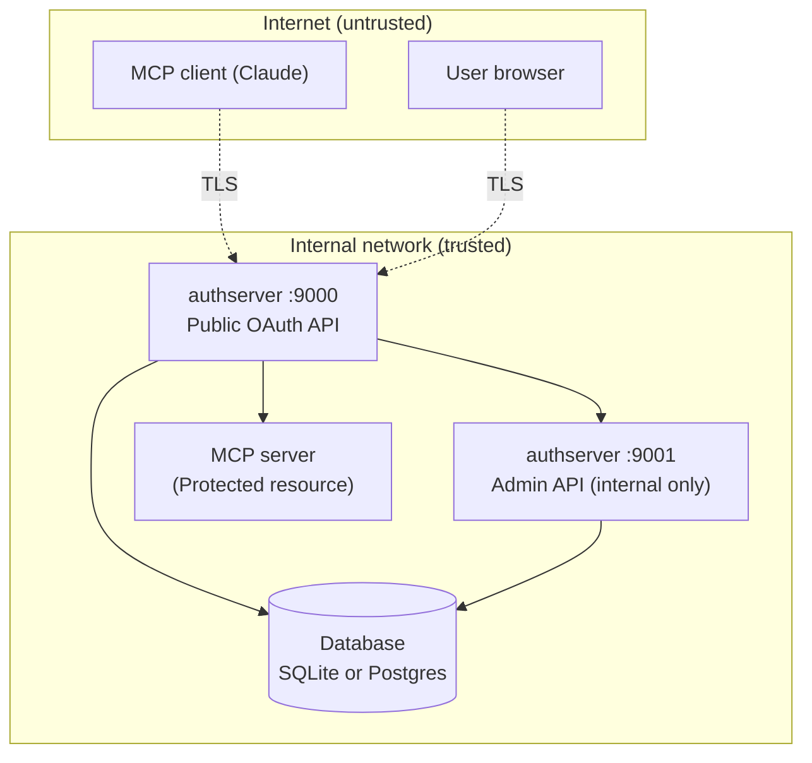

# Threat model

*Context: this is part of [Concepts](README.md). Start with the primer if you haven't.*

**For:** Architects, security reviewers, and operators preparing to deploy
authserver in production.

You want to understand: what attacks does it protect against, what are the
residual risks, and what should you monitor? This document walks through
each threat scenario, explains why it matters, and tells you what authserver
does about it.

## Trust boundaries

**Three trust boundaries matter:**

1. **Internet → TLS termination.** Everything outside your network is
   untrusted. TLS must terminate before authserver (via reverse proxy or
   load balancer).
2. **Public API → Admin API.** The admin port (`:9001`) must never be
   reachable from the internet. It's a separate listener specifically so
   you can firewall it.
3. **authserver → Database.** authserver trusts the database. If the
   database is compromised, all bets are off — but encrypted upstream
   tokens remain protected by the encryption layer.

---

## Threats and mitigations

### T1: Authorization code interception

**Scenario**: An attacker intercepts the authorization code as it travels from authserver to the client via the browser redirect. They try to exchange it for tokens before the legitimate client does.

**Why it fails**:
- **PKCE (S256 only)**: The code is useless without the code verifier, which never leaves the client. Even if the attacker grabs the code from the URL, they can't compute the verifier.
- **Single-use codes**: Atomic `UPDATE ... WHERE consumed_at IS NULL` — only the first exchange succeeds, even under concurrent requests.
- **10-minute expiry**: The window to attempt an attack is very small.
- **Exact redirect URI matching**: No wildcards, no prefix matching, no normalization tricks. The redirect goes exactly where it was registered.

**What to monitor**: `authplane_auth_code_exchange_total` with `result=failure` — a spike means someone is trying to replay codes.

### T2: Refresh token theft and replay

**Scenario**: An attacker steals a refresh token (from the client's storage, a log, or network intercept) and tries to use it to get new access tokens.

**Why it's contained**:
- **Rotation on every use**: Each refresh gives you a new token and invalidates the old one. The attacker and the legitimate client can't both succeed.
- **Reuse detection**: If a consumed refresh token is presented again, authserver revokes the **entire token family** — every refresh token in that chain becomes invalid. Both the attacker and the legitimate client lose access, forcing re-authentication.
- **Hashed storage**: Refresh tokens are stored as SHA-256 hashes. A database breach doesn't expose raw tokens.

**What to monitor**: `authplane_refresh_token_reuse_total` — any non-zero value means someone replayed a consumed token. Investigate immediately.

### T3: Client impersonation

**Scenario**: An attacker registers a client with a redirect URI that intercepts tokens, then tricks users into authorizing it.

**Why it fails**:
- **DCR modes**: In `admin_only` mode, only pre-registered clients exist. In `approved_redirects` mode, only URIs matching approved patterns are allowed.
- **Exact redirect URI matching**: At authorization time, the redirect URI must exactly match what was registered. No creative URL encoding or path traversal.
- **CIMD validation**: For URL-based client IDs, authserver fetches and validates the client metadata document.
- **Client suspension**: The admin API can immediately suspend any client.

**What to monitor**: DCR registration rate — `authplane_dcr_registrations_total`. A sudden spike means someone may be trying to register malicious clients.

### T4: Session hijacking

**Scenario**: An attacker steals the session cookie (via XSS, network sniffing, or physical access to the browser) and impersonates the user.

**Why it's hard**:
- **HMAC-signed cookies**: The session cookie is signed with the session secret. Forging a cookie requires the secret.
- **`HttpOnly`**: JavaScript can't read the cookie (blocks XSS-based theft).
- **`Secure` flag**: In production (non-localhost issuer), the cookie is only sent over HTTPS.
- **`SameSite=Lax`**: Blocks the cookie from being sent on cross-site requests (mitigates CSRF for most cases).

**What to configure**: Set `session.secret` to a strong random value (32+ bytes). Set `session.secure: true` in production. These are enforced by startup validation for non-localhost issuers.

### T5: Credential brute force

**Scenario**: An attacker hammers the login endpoint with password guesses.

**Why it's slow**:
- **Per-IP rate limiting**: The login endpoint has its own rate limiter, separate from the global one.
- **Account lockout**: After `auth_fail_max` failures (default: 10) within `auth_fail_window` (default: 10 minutes), the account is locked for `auth_lockout` (default: 15 minutes).
- **bcrypt hashing**: Each password check takes ~100ms, making brute force computationally expensive.

**What to monitor**: `authplane_auth_failures_total` and account lockout events in the audit log.

### T6: Open redirect

**Scenario**: An attacker crafts a URL like `/authorize?redirect_uri=https://evil.com/steal` to redirect the user (and their auth code) to a malicious site.

**Why it fails**:
- **Exact string match**: The redirect URI must be character-for-character identical to what was registered. `https://app.example.com/callback` won't match `https://app.example.com/callback/extra`.
- **Error page, not redirect**: When the redirect URI is invalid, authserver shows an error page instead of redirecting. This prevents the open redirect entirely.
- **Internal redirects validated**: The login page's `next` parameter is validated by `safeRedirect()` to prevent redirect-to-external-site attacks.

### T7: JWKS spoofing

**Scenario**: An attacker tricks your MCP server into fetching a fake JWKS (containing the attacker's public key), then forges JWTs signed with their private key.

**Why it fails**:
- **Static configuration**: MCP servers must be configured with authserver's issuer URL. They don't discover it dynamically from untrusted sources.
- **HTTPS in production**: The JWKS URL is derived from the issuer URL, which should be HTTPS.
- **Key ID matching**: JWTs include a `kid` claim that must match a key in the JWKS.

**Your responsibility**: Configure your MCP servers with the correct issuer URL over HTTPS. Don't accept JWKS URLs from user input or untrusted metadata.

### T8: Admin API abuse

**Scenario**: An attacker reaches the admin API and uses it to register malicious clients, disable users, or read audit logs.

**Why it fails** (when properly deployed):
- **Separate port**: The admin API runs on `:9001`, not `:9000`. You can firewall them independently.
- **API key required**: In production, every admin request needs a valid API key in the `Authorization: Bearer` header.
- **Audit logged**: Every admin action is recorded — you can trace what happened.

**Your responsibility**: Never expose port `:9001` to the internet. Use a strong API key (32+ random characters). Rotate it if it's ever exposed.

### T9: Signing key compromise

**Scenario**: An attacker obtains the private signing key. They can now forge valid JWTs and impersonate any user to any MCP server.

**Why it's contained**:
- **Restrictive file permissions**: Key files are written with minimal permissions.
- **Vault Transit option**: With Vault Transit, the private key **never leaves Vault** — authserver sends data to Vault for signing, and only gets back the signature.
- **Key rotation**: `authserver admin key rotate` generates a new key immediately. The old key stays in JWKS only for verification of existing tokens.
- **Short token expiry**: Even with a compromised key, forged tokens are only useful until you rotate and MCP servers refresh their JWKS cache.

**Incident response**: Run `authserver admin key rotate` immediately. Wait for MCP servers to refresh JWKS (default 5 minutes). All tokens signed with the old key expire within 15 minutes.

### T10: CIMD document tampering

**Scenario**: An attacker modifies a CIMD metadata document to register their redirect URI for a legitimate-looking client ID.

**Why it fails**:
- **HTTPS required**: In production, CIMD document URLs must use HTTPS.
- **Validation**: CIMD documents are validated for required fields and redirect URI consistency.
- **Caching**: Documents are cached — an attacker who temporarily controls the URL can't re-register after the TTL.

### T11: Stored upstream token theft

**Scenario**: An attacker gets database access and tries to read users' stored third-party tokens (GitHub, Google, Notion, Atlassian, Slack, Linear, or any other provider registered as a connector).

**Why it fails**:
- **Encryption at rest**: All upstream tokens are encrypted with AES-256-GCM (or Vault Transit). The raw token never appears in the database.
- **Per-purpose keys**: HKDF derives separate keys for each purpose from the master key. Database access alone doesn't give you the key.
- **Master key external**: The AES master key is loaded from an environment variable — it's not in the database.
- **Vault Transit option**: With Vault Transit, the plaintext token never touches authserver's memory — encryption and decryption happen inside Vault.

**What to monitor**: Database access patterns. If someone dumps your database, they get ciphertext. As a precaution, rotate your master key: point `data_encryption.aes_master.key_env` at a new env var holding the new key, set `data_encryption.aes_master.old_key_env` to the env var holding the previous key (the AS uses old as decrypt-only fallback during the rotation window), and run a one-off SQL script to re-encrypt `broker_grants.credential_data`; the in-place re-encrypt admin endpoint is on the roadmap.

### T12: Unauthorized upstream token vending

**Scenario**: A malicious MCP server (or client) tries to vend tokens for upstream providers they shouldn't access via token exchange with `resource=<provider>`.

**Why it fails**:
- **Authentication required**: Requires a valid subject token (proving user identity) AND client authentication (proving the server's identity).
- **Three-bound enforcement**: `BrokerIssuer` enforces three checks on every vend:
  1. requested ⊆ `consent_grants.scopes` — the user must have consented for this agent on this resource (bound C).
  2. requested → upstream-mapped ⊆ `broker_grants.scopes_granted` — the user must have authorized the upstream for these scopes (bound E).
  3. The acting client must satisfy the resource's `policy.exchange.allowed_client_ids` — empty allows any consented client.
- **Per-vend refresh**: Each vend refreshes the upstream token rather than caching access tokens; revocation upstream propagates within one vend.
- **Actor token rejection**: Broker exchange rejects actor tokens — it's impersonation-only.
- **Audit trail**: Every issuance is recorded in the `issuances` table with the user, agent, resource, scopes, and `dpop_jkt` (forensics contract — see `the data model` §2.5).

### T13: Connect flow CSRF

**Scenario**: An attacker tricks a user into connecting their GitHub account to the attacker's application.

**Why it fails**:
- **HMAC-signed state**: The state parameter is signed with the session secret and includes a timestamp and return URL. Forging it requires the secret.
- **Short TTL**: State tokens expire quickly.
- **Return URL allowlist**: `allowed_return_urls` restricts where the callback can redirect.
- **Upstream PKCE**: The OAuth flow to the upstream provider (GitHub, etc.) also uses PKCE.

### T14: DPoP proof replay

**Scenario**: An attacker captures a DPoP proof JWT from a network request and replays it to use the associated DPoP-bound access token.

**Why it fails**:
- **JTI uniqueness**: Every DPoP proof must carry a unique `jti`. Duplicates return `ErrDPoPReplay`.
- **Database-backed replay prevention**: `DPoPNonceStore.ConsumeJTI()` atomically checks and records each `jti`.
- **Server-issued nonce**: When `require_nonce: true`, each proof must include a fresh nonce from the server, binding it to a narrow time window.
- **`iat` freshness**: Proofs with timestamps outside the `proof_lifetime` window (default: 2 minutes) are rejected.

**What to monitor**: `authplane_dpop_proofs_rejected_total` with `reason=replay` — any non-zero value means someone is replaying proofs.

### T15: DPoP algorithm confusion

**Scenario**: An attacker submits a DPoP proof with `alg:none` or an HMAC algorithm, tricking the server into accepting an unsigned or self-signed proof.

**Why it fails**:
- **Strict allowlist**: Only ES256, RS256, and PS256 are accepted.
- **`alg:none` unconditionally rejected**: Before any other validation.
- **All HMAC algorithms rejected**: `HS256`, `HS384`, `HS512` — all blocked.
- **Private key in `jwk` header rejected**: Only public keys are accepted in the proof's `jwk` header.

### T16: Token exchange privilege escalation

**Scenario**: A client uses token exchange to get a token with broader scopes than the original subject token had.

**Why it fails**:
- **Scope subset enforcement**: The exchanged token's scope must be ≤ the subject token's scope.
- **Chain depth limit**: `max_chain_depth` prevents unbounded delegation.
- **Self-exchange blocked** (by default): A client can't exchange its own token back to itself unless `allow_self_exchange` is explicitly enabled.
- **`may_act` claim check**: The requesting client must be authorized — either via the `may_act` claim in the subject token or via the configuration allowlist.

### T17: Cross-client unauthorized exchange

**Scenario**: An attacker registers an MCP server client and tries to exchange tokens belonging to users of a different application.

**Why it fails**:
- **Per-resource exchange policy**: Each Mint or Broker resource carries `policy.exchange.allowed_client_ids` — only clients in that list (or any consented client when the list is empty) may act for that resource.
- **Both identities checked**: The subject token's `client_id` (which app issued it) and the requesting client's `client_id` (who's asking for the exchange) must both pass the per-resource policy.
- **Consent** still applies: even an allowed client must have a `consent_grants` row for the (user, agent, resource) tuple covering the requested scopes.
- **Audit trail**: Both client IDs are recorded on the `issuances` row for every exchange.

### T18: Machine token abuse

**Scenario**: A compromised backend service uses the client credentials grant to mint machine tokens and access MCP tools.

**Why it's contained**:
- **Grant type enforcement**: Only clients explicitly registered with `grant_types: [client_credentials]` can use this flow.
- **Confidential clients only**: Public clients (no secret) can't request machine tokens.
- **No refresh tokens**: Machine tokens expire and can't be renewed without the client secret. If you rotate the secret, the old service stops working.
- **Individual revocation**: Machine tokens are stored by JTI and can be revoked individually.
- **Short expiry**: Default 1 hour. Even without revocation, a stolen token is time-limited.

**Incident response**: Suspend the client via `PATCH /admin/clients/{id}/suspend`. Revoke active tokens via `POST /oauth/revoke`. Register a new client with a fresh secret.

---

## What to monitor in production

These are the signals that tell you something might be wrong:

| Signal | Metric / Log | What it means |
|--------|-------------|---------------|
| Refresh token reuse | `authplane_refresh_token_reuse_total` | Someone replayed a consumed token. Possible theft. |
| Auth failures spike | `authplane_auth_failures_total` | Brute force attempt or credential stuffing. |
| DPoP replay attempts | `authplane_dpop_proofs_rejected_total{reason=replay}` | Someone is replaying captured DPoP proofs. |
| Token exchange denials | `authplane_token_exchange_denied_total` | Unauthorized exchange attempts. Check the `reason` label. |
| Machine token denials | `authplane_client_credentials_denied_total` | Clients trying grants they're not authorized for. |
| Admin API audit events | Audit log: `action=client_registered`, `client_suspended`, etc. | Track all administrative changes. |

---

## Incident response playbook

### Token theft (access or refresh)

1. **Revoke**: `POST /oauth/revoke` with the token (or the client's ID if you don't have the token).
2. **Check audit log**: `GET /admin/audit?client_id=<affected_client>` to see what the token was used for.
3. **If refresh token was stolen**: The family is already revoked by reuse detection. Force re-authentication.
4. **Consider DPoP**: If tokens are being stolen in transit, enable DPoP to bind tokens to client key pairs.

### Signing key compromise

1. **Rotate immediately**: `authserver admin key rotate`
2. **Wait for JWKS propagation**: MCP servers refresh JWKS every 5 minutes by default.
3. **All existing access tokens** expire within 15 minutes (default expiry).
4. **Refresh tokens** continue to work (they're not JWTs — they're verified by database lookup).
5. **Review**: Check if the attacker forged any tokens by correlating `jti` values with the token store.

### Admin API key leak

1. **Rotate the API key**: Update `AUTHPLANE_ADMIN_API_KEY` and restart authserver.
2. **Review audit log**: Check what the attacker did with admin access.
3. **Suspend any clients** created by the attacker.
4. **Verify**: Check that no users were disabled or modified.

### Database breach

1. **Vault tokens are encrypted**: The attacker gets ciphertext, not raw tokens. But still:
2. **Rotate master key**: point `data_encryption.aes_master.key_env` at a new env var holding the new key, and `data_encryption.aes_master.old_key_env` at the env var holding the previous key (decrypt-only fallback). Re-encrypt `broker_grants.credential_data` with a one-off SQL script — the in-place re-encrypt admin endpoint is on the roadmap.
3. **Rotate signing key**: `authserver admin key rotate` — assume the old key is compromised.
4. **Reset all user passwords**: Via admin API.
5. **Revoke all client secrets**: Register new clients with fresh secrets.

---

## Known limitations

These are things authserver doesn't protect against. They're design decisions, not bugs.

| Limitation | Why it exists | What you can do |
|-----------|--------------|-----------------|
| **Single signing key per instance** | Simplicity. Multi-region deployments need shared keys. | Use Vault Transit or `postgres_key` store for HA deployments. |
| **No client authentication for public clients** | MCP clients (Claude Code, Claude Desktop) can't keep secrets. MCP spec requires public clients. | Security relies on PKCE + refresh token rotation. This is standard OAuth 2.1 practice. |
| **In-memory rate limiting** | Counters reset on restart and aren't shared across instances. | Use an external rate limiter (load balancer, API gateway) for multi-instance deployments. |
| **No mTLS termination** | authserver doesn't terminate TLS — it's designed to run behind a reverse proxy. | Put Caddy, nginx, or a load balancer in front with proper TLS configuration. |
| **JWT revocation is not instant** | JWTs are verified locally by MCP servers. A revoked JWT remains valid until it expires or the MCP server checks introspection. | Keep token expiry short (15 minutes default). Use the introspection endpoint for real-time revocation checks. |

---

## Security contacts

Report security vulnerabilities to the project maintainers via the private disclosure process described in `SECURITY.md` at the repository root.

## Where to go next

- [Tokens and claims](tokens-and-claims.md) — the token shape each threat
  applies to.
- [DPoP and proof of possession](dpop-and-proof-of-possession.md) — the
  primary defense against token theft (T2, T14, T15).
- [Key rotation guide](../guides/operate/key-rotation.md) — the
  operational counterpart to T9.
- [Observability with Prometheus and OTel](../guides/deploy/observability-prometheus-otel.md) — how
  to wire up the metrics this page references.
