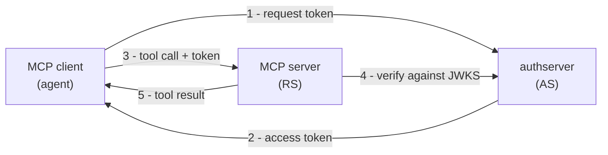

# What is Authplane

*Context: this is part of [Concepts](README.md). Start with the primer if you haven't.*

Authplane is an OAuth 2.1 [Authorization Server](glossary.md#glossary-authorization-server)
(the "AS") purpose-built for the Model Context Protocol. It sits between MCP
clients (Claude Desktop, Claude Code, custom [agents](glossary.md#glossary-agent))
and MCP servers (your tools), brokering identity, consent, and token issuance.

## The envelope

Five entities, one envelope:

| Term | What it is |
|------|------------|
| MCP client | The agent runtime. Holds the conversation, calls the AS to get tokens, calls the MCP server to invoke tools. |
| AS | authserver. Authenticates users, registers clients, mints tokens. |
| Token | A signed credential ([JWT](glossary.md#glossary-jwt) by default) representing "this caller may do these things". |
| MCP server | The [resource server](glossary.md#glossary-resource-server) — the thing the agent is calling. Verifies tokens, runs tools. |
| Resource | The MCP server (or upstream provider) as the AS knows it — one row in the `resources` table with a slug, backend kind, and scope catalog. |

Everything else in this section is a refinement of those five.

## Why an AS sits in the middle

Direct trust between agents and tools doesn't scale. Each MCP server would need
to maintain its own user database, its own consent UX, its own session model.
By delegating to a single AS, every MCP server gets:

- **Identity** — a user the AS authenticated (locally, via OIDC, or via [XAA](glossary.md#glossary-xaa)).
- **Authorization** — [scopes](glossary.md#glossary-scope) the user explicitly consented to.
- **Audience binding** — the token is only valid for *this* MCP server (`aud` claim).
- **Agent identity** — when the caller is a registered agent, an `agent_id` claim travels with the token.
- **Revocation** — one place to disable a user or rotate a key.
- **Audit** — every issuance lands in the `issuances` table.

## What flows over the wire

1. **Discovery.** The MCP client fetches the MCP server's
   [Protected Resource Metadata](glossary.md#glossary-protected-resource-metadata)
   (PRM, RFC 9728) at `/.well-known/oauth-protected-resource/<mcp-path>`
   (for an MCP server serving at `/mcp`, that's
   `/.well-known/oauth-protected-resource/mcp`). PRM is served by the MCP
   server (the Authplane SDK adapter wires the handler), not by the AS. It
   tells the client which AS to use and which scopes the resource accepts.
2. **AS metadata.** The client fetches the AS's
   `/.well-known/oauth-authorization-server` to find the authorize/token/JWKS
   endpoints.
3. **Registration.** Either the client is already registered, or it registers
   via [DCR](glossary.md#glossary-dcr) (RFC 7591) or
   [CIMD](glossary.md#glossary-cimd).
4. **Authorization.** For user-driven flows: redirect to `/authorize` with
   [PKCE](glossary.md#glossary-pkce), user logs in and grants
   [consent](glossary.md#glossary-consent).
5. **Token.** The client `POST`s to `/oauth/token` to exchange the auth code
   (or assertion, or refresh token) for an
   [access token](glossary.md#glossary-access-token).
6. **Tool call.** The client sends the token (in `Authorization: Bearer …` or
   `Authorization: DPoP …`) to the MCP server with each request.
7. **Verification.** The MCP server verifies the token offline against the
   AS's [JWKS](glossary.md#glossary-jwks).

## What authserver is not

- **Not an IdP.** authserver authenticates users (local email/password is
  built in), but its more common deployment is to federate to an existing
  IdP via OIDC or [JWT Bearer](glossary.md#glossary-jwt-bearer). See
  [Identity and federation](identity-and-federation.md).
- **Not an API gateway.** It doesn't proxy MCP traffic — tokens go directly
  from client to MCP server.
- **Not a secrets manager.** It can store upstream-provider refresh grants
  (encrypted) for [Broker](glossary.md#glossary-broker-backend) resources,
  but it's not a vault — use HashiCorp Vault or your KMS for arbitrary
  secrets.

## Where to go next

- [Resources and scopes](resources-and-scopes.md) — the data model for what
  authserver issues tokens for.
- [Tokens and claims](tokens-and-claims.md) — the wire shape of those tokens.
- [Architecture](architecture.md) — the layout of the codebase.
