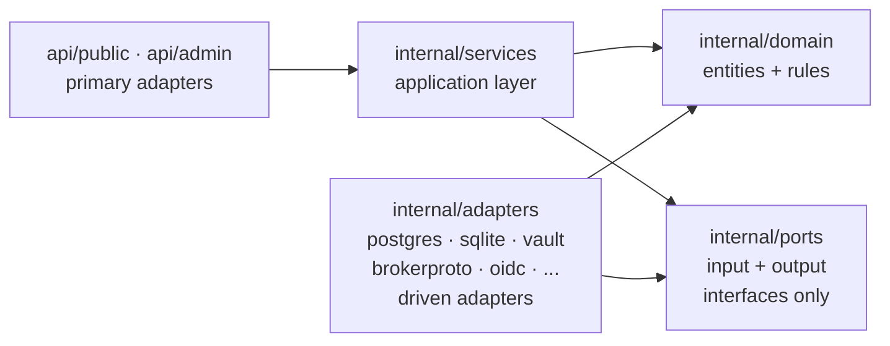

*Context: this is part of [Contribute](README.md). Start with the primer if you haven't.*

# Hexagonal layers — where do I put what?

authserver follows ports & adapters strictly. The boundaries are
enforced by `make check-imports` (run as part of `make ci-local`) — a
violation is a build failure. This page is the decision guide for
**which layer to start in** when you implement a change.

## The layer stack

Read the arrows as "is allowed to import". The crucial inversions:

- `internal/services/` calls `internal/ports/output/` interfaces;
  adapters implement them. Services never see concrete adapter types.
- `internal/ports/` imports only `internal/domain/` and the standard
  library — no `services`, no `adapters`, no `config`, no `crypto`.
- `api/` imports `internal/ports/input/`, `internal/domain/`, and
  `internal/config/`. It never reaches into `internal/services/`
  directly, nor into `internal/adapters/`.

Encyclopedia rationale + diagram in
[`docs/concepts/architecture.md`](../concepts/architecture.md). Boundary
enforcement is implemented in the `check-imports` target of the
[`Makefile`](../../Makefile).

## Decision table

Use the first column to find your change; the rest tells you where to
start and which files to touch.

| I want to add… | Start in | Touch these |
|---|---|---|
| A new public HTTP endpoint (OAuth/MCP) | `api/public/<area>/` | `handlers.go` + `routes.go` in that subtree, then an input port in `internal/ports/input/`, then a service in `internal/services/`, then wire it in `cmd/authserver/serve.go` |
| A new admin endpoint | `api/admin/<area>/` | Same pattern as public; DTOs in `api/admin/dto.go` |
| A new OAuth grant type | `internal/ports/input/<grant>.go` | Port → service in `internal/services/<grant>.go` → dispatch arm in `api/public/oauth/handlers.go` → metadata in `api/public/wellknown/handlers.go` → feature gate in `internal/config/` |
| A new upstream provider (OAuth/API-key/SA) | `internal/adapters/brokerproto/<name>/` | Adapter implements `output.BrokerProtocol`; register in `cmd/authserver/serve.go`; document in `docs/guides/upstream-providers/<name>.md` |
| A new storage backend | `internal/adapters/<driver>/` | Implement every relevant `internal/ports/output/*` interface; add migration tree under `migrations/<driver>/`; wire in `cmd/authserver/serve.go` |
| A new domain entity | `internal/domain/<aggregate>/entity.go` | Entity + value objects + invariants + tests; no infrastructure imports |
| A new audit event | `internal/domain/audit/` | Event type → emit in the relevant service → adapter persistence |
| A new metric | `internal/observability/metrics.go` | Define the metric; record from the service that owns the call site |
| A new configuration option | `internal/config/config.go` | Add the field, default, validation; env-var binding in `internal/config/loader.go`; regenerate `docs/reference/configuration.md` + `env-vars.md` via `make docs-gen` |
| A new domain error | `internal/domain/errors.go` | Append a sentinel; wire to the HTTP error mapping in `api/shared/` if the error escapes the boundary |

## Common pitfalls

- **Importing a concrete adapter from a service** — services depend on
  `internal/ports/output/`, never on `internal/adapters/`. If you find
  yourself reaching for `adapter.New(...)` inside a service, your
  dependency is inverted; promote the type to a port.
- **HTTP handlers calling adapters directly** — handlers depend on
  input ports. The composition root in `cmd/authserver/serve.go` is the
  *only* place that knows both a port interface and its concrete
  adapter.
- **Storage transactions leaking out of the adapter** — keep `*sql.Tx`,
  `pgx.Tx`, and friends inside `internal/adapters/{sqlite,postgres}/`.
  Cross-aggregate atomicity goes through a port that exposes a
  unit-of-work closure, not a transaction handle.
- **Domain importing infrastructure** — `internal/domain/` must be
  reachable from a fresh Go install with no external deps beyond the
  standard library and `gofrs/uuid`. Anything else is wrong.
- **The registry living in `internal/ports/`** — the brokerproto
  registry sits in `internal/brokerproto/`, not in
  `internal/ports/output/`, so the ports tree stays pure-interface. The
  rationale is in
  [`internal/brokerproto/registry.go`](../../internal/brokerproto/registry.go).
- **Hand-edits to generated reference docs** — `docs/reference/cli.md`,
  `http-api.md`, `env-vars.md`, `configuration.md` carry a
  `<!-- generated by tools/docsgen -->` header. Regenerate via
  `make docs-gen`; never edit them by hand.

Deeper reading: [`docs/concepts/architecture.md`](../concepts/architecture.md).
