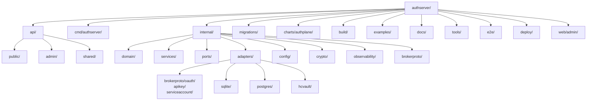

*Context: this is part of [Contribute](README.md). Start with the primer if you haven't.*

# Repo tour

A walkthrough of the authserver source tree, organised top-down. Use it
to figure out **which directory owns the concern you're changing** before
you reach for grep.

## `api/public/`

OAuth, OIDC, MCP discovery, DCR, and well-known endpoints — the surface
exposed on port `9000`. The token endpoint dispatches by `grant_type`
into the matching application service. Subtrees:

- `oauth/` — authorize, token, revoke, introspect, register, consent,
  login, DPoP.
- `wellknown/` — `/.well-known/oauth-authorization-server` (RFC 8414),
  JWKS, protected resource metadata, health, metrics.
- `connection/` — upstream-provider connect flow (`/connect/<provider>/…`).

Routes are wired via `routes.go` files within each subtree; no global
mux. Touch this layer when you're adding a public endpoint or changing
request/response wire shape.

## `api/admin/`

Provisioning + operations endpoints exposed on port `9001` — Resources,
BrokerProviders, Grants, Issuances, Clients, Keys, Users. Same shape as
`api/public/`: each subtree owns its own `routes.go`. DTOs in
`api/admin/dto.go` are the canonical wire shape (the generated
`docs/reference/http-api.md` reflects them).

The Admin UI is served from the same port at `/admin/ui/` from a
`go:embed` of `web/admin/dist/`.

## `api/shared/`

Small helpers shared by both API subtrees — RFC 6749 / 6750 error
helpers, request parsing, client authentication parsing. Pure utility,
no business logic.

## `cmd/authserver/`

The cobra-based CLI entry point and the application composition root.
`main.go` declares the root command; the per-feature files (`serve.go`,
`admin_resource.go`, `admin_provider.go`, `admin_grant.go`, …) wire
subcommands. `serve.go` is the dependency-injection graph: it constructs
every adapter, every service, every handler, and binds them together.

Touch this directory when adding a new subcommand, when wiring a new
service into the server, or when registering a new brokerproto adapter.

## `internal/config/`

The single typed configuration struct (`Config` in `config.go`), the
loader that reads YAML and overlays `AUTHPLANE_*` env vars
(`loader.go`), and validation. Every operator-facing knob starts here;
the generated `docs/reference/{configuration,env-vars}.md` are derived
from these files.

## `internal/services/`

The application layer — business logic. One service per use case; flat
files in this directory (no `_service` suffix, no nested per-feature
packages — see existing files like `authorize.go`, `broker_issuer.go`,
`client_credentials.go`, `token_exchange.go`, `jwt_bearer.go`).

Services depend on `internal/ports/` interfaces and on `internal/domain/`
entities. They never import `internal/adapters/`.

## `internal/domain/`

Entities, value objects, and business rules — zero infrastructure
dependencies. Subpackages by aggregate (`client`, `resource`, `token`,
`session`, `user`, `scope`, `audit`, `idp`, `xaa`) plus the shared
sentinel `errors.go`. New domain types live here.

## `internal/ports/`

Interface definitions consumed by services and implemented by adapters.
Split into `input/` (driving interfaces, called by handlers) and
`output/` (driven interfaces, called by services). Pure-interface
package: no third-party imports beyond standard library and
`internal/domain`. Enforced by `make check-imports`.

## `internal/adapters/`

Driven adapters — every infrastructure plug-in lives here. Each adapter
is a sibling package:

- `sqlite/`, `postgres/` — the two storage backends.
- `brokerproto/oauth/`, `brokerproto/apikey/`, `brokerproto/serviceaccount/`
  — upstream-protocol plug-ins; registered in `internal/brokerproto/`
  at startup. See [add-an-upstream-provider.md](add-an-upstream-provider.md).
- `aesmaster/`, `hcvault/`, `keyfile/`, `signing/`, `encryption/` —
  KMS / key-material / encryption-at-rest backends.
- `oidc/`, `idpjwks/` — upstream identity-provider integrations for
  federated login and JWKS resolution.
- `cimd/` — Client ID Metadata Document fetcher.
- `storage/` — adapter-shared helpers (transaction guards, etc).

Adapters never import each other.

## `internal/brokerproto/`

The registry + secret-rules helpers for the upstream-provider plug-in
plane. Lives outside `internal/ports/output/` so the ports tree stays
pure-interface, but is consumed by both `cmd/` (registration) and
`internal/services/broker_issuer.go` (lookup). See
[hexagonal-layers.md](hexagonal-layers.md) for why the registry sits
here.

## `internal/observability/`

Tracing setup (OpenTelemetry), metrics (Prometheus client_golang),
structured logging (`log/slog`), audit-event emit. All services thread
spans + structured logs through this package.

## `internal/crypto/`

JWT signing/verification, PKCE generation/verification, DPoP proof
verification, key generation. Pure-Go primitives with no external
infrastructure dependencies — sits below services in the hexagonal stack.

## `migrations/sqlite/`, `migrations/postgres/`

Per-driver schema migrations, numbered. The two trees diverge for a
reason — SQLite and PostgreSQL have different JSON, timestamp, and
locking semantics. When you add a column, add it to both.

## `charts/authplane/`

The Helm chart. `Chart.yaml` carries `version` (chart) and `appVersion`
(authserver image tag); both move on release. `values.yaml` is the
canonical operator surface; the chart README documents every key.

## `build/`

`Dockerfile` for `make docker-build`. `Dockerfile.goreleaser` for the
multi-arch images that ship as `authplane/authserver:<tag>` via
goreleaser.

## `examples/`

Runnable proof-of-integration code — one example per integration
pattern, organised as `examples/<lang>/<NN-name>/`. Each example has its
own `Makefile` with at minimum `run`, `verify`, `clean` targets. The
`make docs-smoke` target walks every example and exercises that cycle.

## `docs/`

The operator + reference documentation tree:

- `concepts/` — what authplane is, what tokens carry, how policy works.
- `start/` — quickstarts.
- `guides/` — how-tos by audience (deploy, integrate, operate, federation, upstream-providers).
- `topologies/` — named deployment patterns (Broker MCP, Mint, XAA, …).
- `reference/` — generated CLI, HTTP API, env vars, configuration.
- `contribute/` — **you are here**.

Agent guidance for the whole repo lives in [`AGENTS.md`](../../AGENTS.md) at the root — that's the convention Claude Code / Cursor / similar IDE agents follow.

## `e2e/`

End-to-end scenarios that spin up a real authserver binary and drive it
through HTTP — never importing `internal/...`. The `harness.go` boots
the server; `scenarios/` holds one Go test file per flow under build
tag `e2e`. See [running-tests.md](running-tests.md).

## `tools/`

Repo-local Go tooling:

- `docsgen/` — regenerates `docs/reference/{cli,http-api,env-vars,configuration}.md` from source.
- `docssmoke/` — runs every example's `make run` / `verify` / `clean` cycle.
- `loccount/` — per-example line-of-code accounting + budget enforcement.

## `deploy/`

Docker Compose stacks for local development:

- `docker-compose.sqlite.yml` — quickstart (authserver only, SQLite).
- `docker-compose.yml` — PostgreSQL + authserver + LGTM observability.
- `docker-compose.test-postgres.yml` — PostgreSQL just for the test suite.
- `observability/docker-compose.observability.yml` — Alloy, Tempo, Loki, Mimir, Prometheus, Grafana.

## `web/admin/`

The React Admin UI, built with Vite. `npm ci && npm run build` produces
`web/admin/dist/`, which is `go:embed`ed into the binary and served from
the admin port at `/admin/ui/`.

## `scripts/`

Repository hygiene scripts — OSS-leak detection (`check-oss-leak.sh`),
quickstart-block linter, Gate 0 import checker. Triggered from the
`make` gates; don't invoke directly outside CI debugging.
