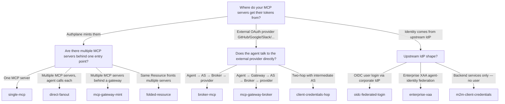

# Topologies

**For:** Architects deciding which deployment shape fits their constraints.
**Time:** ~10 min to pick a topology + ~5 min per topology page to read.
**Prereqs:** [Concepts](../concepts/) — [Resource](../concepts/glossary.md#glossary-resource), [Mint backend](../concepts/glossary.md#glossary-mint-backend), [Broker backend](../concepts/glossary.md#glossary-broker-backend), [DPoP](../concepts/glossary.md#glossary-dpop), [agent chain](../concepts/glossary.md#glossary-agent-chain), [XAA](../concepts/glossary.md#glossary-xaa).

> *Context: this section assumes the vocabulary from [Concepts/Glossary](../concepts/glossary.md). If anything's unfamiliar, that's where to start.*

This directory describes every deployment shape authserver supports —
what the components are, what the wire flow looks like, when to pick
each shape, how to wire it up, and what authserver does behind the
curtain. Each page is self-contained for one topology with the same
structure: a topology diagram with named components, a wire-level
sequence diagram, an operator playbook, and a peek at the AS internals
(tables, services, gates).

If you know what you want to build but haven't yet decided which OAuth
grant or authplane feature it maps to, **start here**. For grant-by-grant
or feature-by-feature reference material, see [`guides/`](../guides/) —
grant-type guides are grouped under
[`integrate/`](../guides/integrate/),
[`federation/`](../guides/federation/), and
[`upstream-providers/`](../guides/upstream-providers/).

---

## Decision tree — which topology do I need?

Read the question at each node, follow the matching arrow, land on a
topology slug. Many real deployments stack several — see
[Combining topologies](#combining-topologies) below.

---

## Topology catalog

| Topology | One-line summary | When to use |
|---|---|---|
| [single-mcp](single-mcp.md) | One agent, one [Mint Resource](../concepts/glossary.md#glossary-mint-backend), one user — auth-code + PKCE | The canonical baseline; pick first when in doubt |
| [direct-fanout](direct-fanout.md) | One agent, many independent MCPs, per-MCP user consent | Multiple unrelated MCPs all need user authorization |
| [folded-resource](folded-resource.md) | One [Resource](../concepts/glossary.md#glossary-resource) fronts many internal services | Internal services share audit/ownership; no separate registrations |
| [client-credentials-hop](client-credentials-hop.md) | Gateway calls hidden infra as itself; drops user context | Hidden API is unrelated infra and per-user audit doesn't matter |
| [mcp-gateway-mint](mcp-gateway-mint.md) | Gateway fronts a hidden Mint Resource via a [fronting link](../concepts/glossary.md#glossary-fronting-link); chain on the wire | Full encapsulation; need per-user audit through the act-claim chain |
| [mcp-gateway-broker](mcp-gateway-broker.md) | Gateway fronts an upstream-IdP-backed service; vends upstream bearer | Hidden Resource is a [Broker](../concepts/glossary.md#glossary-broker-backend); chain lives in AS audit only |
| [broker-mcp](broker-mcp.md) | Agent talks directly to a Broker Resource — AS vends upstream bearer per request | Agent legitimately needs to see the broker; no gateway in the way |
| [m2m-client-credentials](m2m-client-credentials.md) | Backend service authenticates as itself; no user in the loop | Cron jobs, batch ETL, internal microservices |
| [oidc-federated-login](oidc-federated-login.md) | Users sign in via their corporate IdP (Okta, Google, Entra) | You want SSO; you don't want authserver storing passwords |
| [enterprise-xaa](enterprise-xaa.md) | Corporate IdP asserts agent identity via [XAA](../concepts/glossary.md#glossary-xaa) (RFC 7523 JWT-Bearer) | Compliance requires the agent-identity trust anchor be the corporate IdP |

### Tracked / not yet shipped

- **Co-authorization at first `/authorize`** — single consent screen for
  multiple resources via repeated `resource=` parameters
  (RFC 8707 multi-resource authorization). On the roadmap. Until it
  ships, fall back to direct fanout (sequential per-MCP consent) or
  the MCP gateway pattern (encapsulation behind a single consent).

---

## Notation

Topology and sequence diagrams across this directory use these node
names consistently.

| Symbol in diagrams | Means |
|---|---|
| `User` | Human user, typically in a browser |
| `Ag` / `Agent` | [Agent](../concepts/glossary.md#glossary-agent) — the OAuth client (Claude Code, ChatGPT, custom) |
| `AS` | [Authorization Server](../concepts/glossary.md#glossary-authorization-server) (authserver) — issues / vends tokens |
| `RS` / `MCP` | [Resource Server](../concepts/glossary.md#glossary-resource-server) — an MCP server. With [`backend_kind: mint`](../concepts/glossary.md#glossary-mint-backend) the AS signs the token; with [`backend_kind: broker`](../concepts/glossary.md#glossary-broker-backend) the AS vends an upstream IdP token. |
| `GW` / `Gateway` | An MCP that proxies to other resources via a [fronting link](../concepts/glossary.md#glossary-fronting-link) |
| `IdP` | Upstream Identity Provider (Okta, Entra ID, Google Workspace, …) |
| `Backend` | Backend service authenticating as itself ([client_credentials](../concepts/glossary.md#glossary-client-credentials-grant)) |

Edge labels carry the wire payload: `token bound to <slug>`,
`grant=client_credentials`, `RFC 8693 exchange`, etc. Subgraphs mark
encapsulation boundaries (e.g. "invisible to AS").

---

## How to read each page

Every page below uses the same shape:

1. **At a glance** — one-line summary; encapsulation, audit, and ship traits.
2. **Topology** — component diagram, named nodes, encapsulation boundaries.
3. **Flow** — wire-level sequence diagram, step by step.
4. **When to use** — positive cases and explicit "don't use when".
5. **How to configure** — operator commands, end to end, in three parallel modes (see below).
6. **How authserver handles it** — the tables, services, and gates AS-side.
7. **Verify it** — how to confirm wiring is correct (audit query, JWT inspection).
8. **See also** — related grants, features, and runnable examples.

## Three configuration modes

Every topology can be configured **three equivalent ways** — pick one
and stay in it for the whole walkthrough. All three end with the same
authserver-side state.

| Mode | Where | Best for |
|---|---|---|
| **Admin UI** | `http://localhost:9001` (React SPA embedded in the AS binary) | Exploring, one-off setup, visual confirmation |
| **CLI** | `authserver admin <subcommand>` | Local development, scripting, single-host operators |
| **REST API** | `POST /admin/...` against `:9001` | CI/CD pipelines, infrastructure-as-code, multi-environment provisioning |

Auth applies uniformly across all three: all three modes use the same
admin API key from the `AUTHPLANE_ADMIN_API_KEY` env var (or YAML
`admin.api_key`). The Admin UI prompts for it on first load and stores
it in `sessionStorage` (cleared when the browser tab closes); the CLI
and REST API read it directly from the env. Set it once before any of
the three modes work.

Each topology page presents the three modes as parallel self-contained
sections so you never need to mix curl and CLI in the same walkthrough.
Where a feature is **not** available in all three modes — federation
provider config and the XAA issuer policy are YAML-only at v0.1.x — the
page calls that out explicitly at the top of its Configure section.

For CLI and REST API field-level reference, see:

- CLI: `authserver admin --help` (or any subcommand `--help`)
- REST API: [docs/reference/http-api.md](../reference/http-api.md) (generated)

---

## Combining topologies

These shapes compose. A real deployment commonly stacks several:

- **OIDC-federated user login** (Okta) **+ agent + multiple MCPs** —
  users sign in via Okta, then each agent independently fans out to
  MCPs A, B, C with per-MCP consent.
- **MCP gateway → broker** in front of Google Calendar **+ MCP gateway →
  hidden Mint** in front of internal scheduling service — one gateway
  serves both fronted patterns to different downstream resources.
- **Enterprise XAA + MCP gateway → hidden Mint** — corporate-IdP-signed
  agent identity flows through the act-claim chain to an internal API.

When in doubt, model each hop as its own topology and stack them.
