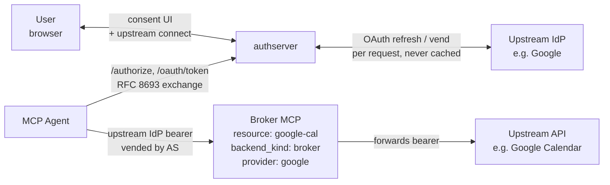
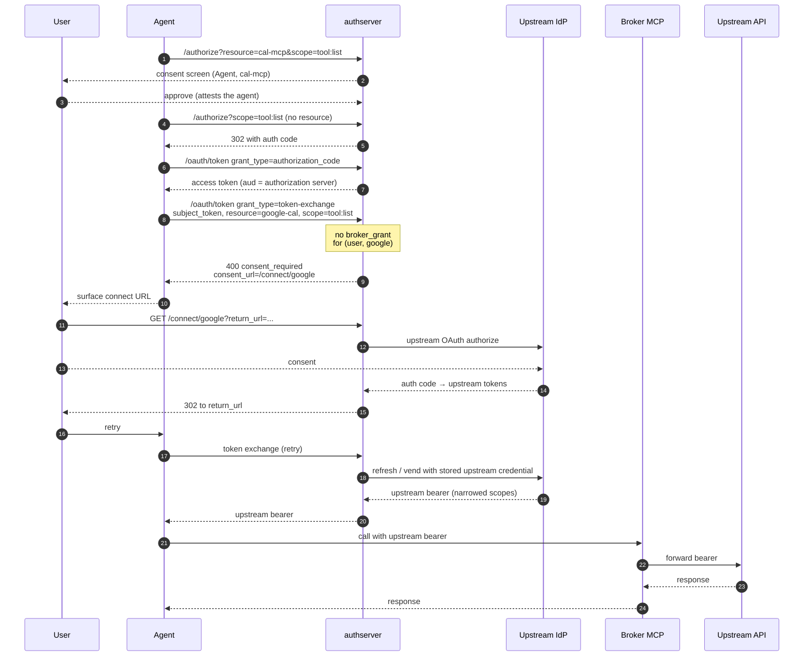
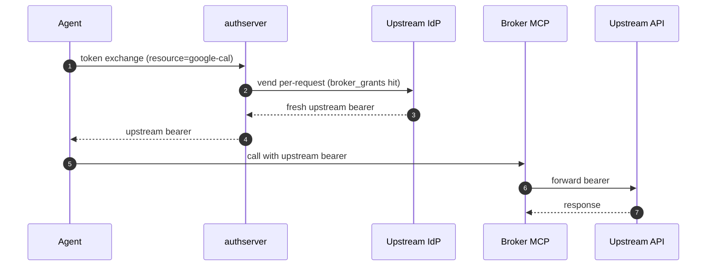

# Agent + Brokered MCP

*Context: part of [Topologies](README.md). Start with the decision tree if you haven't.*

> **At a glance.** The MCP wraps an upstream OAuth provider (Google,
> GitHub, Linear, …) — a
> [Broker backend](../concepts/glossary.md#glossary-broker-backend)
> [Resource](../concepts/glossary.md#glossary-resource). authserver
> brokers tokens from the upstream IdP per request — the
> [agent](../concepts/glossary.md#glossary-agent) never sees the
> upstream credentials, the upstream API never sees authserver.
> Per-user audit. Shipped at v0.1.x.

> **An upstream connection belongs to a user.** The broker looks up the
> stored upstream grant by the subject token's `sub`, so the subject
> token must be a user's token, or an agent's token issued on a user's
> behalf. A `client_credentials` token's `sub` is the client itself, and
> no user can connect an upstream account for it, so such an exchange is
> always refused (through a fronting link, with `consent_required` and
> audit reason `upstream_connection_missing`).

> **How the agent gets a broker token.** A Broker Resource is never the
> target of `/authorize` — the server refuses it with `400`. The agent
> is bound to its own Mint Resource (here `cal-mcp`), the user consents
> to the agent there, and the agent then exchanges a token with
> `resource=google-cal` (RFC 8693). The upstream bearer comes back from
> that exchange.
>
> **Common mistake — `fronting_link_missing` error.** If the exchange
> returns `400 invalid_request` with "no fronting link declared from
> <X> to <Y>", the subject token is audienced to a Mint Resource (`aud`
> = `cal-mcp`), so the server reads the call as a gateway exchange.
> Either obtain the subject token without a `resource` parameter (its
> `aud` is then the authorization server itself), as below, or switch
> to [mcp-gateway-broker.md](mcp-gateway-broker.md) and declare the
> fronting link.

## Topology



The components:

- **Broker MCP** — a Resource with `backend_kind: broker`, pointing at a
  registered `broker_provider` row (the upstream OAuth app).
- **Upstream IdP** — Google, Okta, GitHub, etc. Holds the user's
  credentials; signs the bearer the upstream API will accept.
- **authserver** — orchestrates two
  [consents](../concepts/glossary.md#glossary-consent) (user→agent at
  the AS, user→upstream at the IdP) and vends a fresh
  [scope](../concepts/glossary.md#glossary-scope)-narrowed bearer on
  every `/oauth/token` call. Missing upstream consent surfaces as a
  [`ConsentRequiredError`](../concepts/glossary.md#glossary-consentrequirederror).

## Flow

### First-time path (with upstream connect)



### Subsequent calls



The upstream bearer is **never cached** in authserver — every
`/oauth/token` call hits the upstream IdP.

## When to use

- The MCP is a thin proxy in front of a third-party OAuth-protected API
  (Google Calendar, Linear, GitHub).
- You want the user's upstream credentials managed by authserver (not
  scattered across MCP servers).
- The upstream API expects its own bearer on the wire.

**Don't use when:**

- The MCP issues its own tokens with its own scope catalog → use
  [single-mcp.md](single-mcp.md).
- You want a gateway pattern with full encapsulation (the agent doesn't
  see the upstream resource at all) → use
  [mcp-gateway-broker.md](mcp-gateway-broker.md).

## How to configure

Four operations: (1) register the upstream provider; (2) register the
Broker Resource pointing at that provider; (3) register the agent as a
confidential OAuth client with the `authorization_code` and
token-exchange grants; (4) register the agent's own Mint Resource
(`cal-mcp`) with the agent in its `policy.runtime.client_ids`. The
user consents to the agent at `cal-mcp`; that consent is what the
server checks before vending (the agent-attestation gate), and its
scope names must match the Broker Resource's.

The upstream OAuth client secret is **not** stored in the AS database
— authserver reads it from an environment variable named via
`client_secret_ref`. Export the secret in the AS process environment
before any of the three modes below.

**Env var name allowlist.** The brokerproto/oauth adapter rejects any
`client_secret_ref` value that does not match
`^(CONNECTOR_|AUTHPLANE_VAULT_)[A-Z][A-Z0-9_]*$`
(`internal/brokerproto/secretrules.go`). The prefix prevents
operator-supplied config from naming arbitrary process env vars
(`PATH`, `AWS_*`, …) and having the adapter return their values as a
"client secret". Pick `CONNECTOR_*` for upstream OAuth apps,
`AUTHPLANE_VAULT_*` for vault-managed secrets — anything else fails
at vend time with `errSecretLookup: invalid env var name`.

```bash
export CONNECTOR_GOOGLE_SECRET=<google-oauth-client-secret>
```

**Google requires `extra_auth_params` for refresh tokens.** Google
only issues a `refresh_token` when the authorize URL carries
`access_type=offline` AND `prompt=consent`. Without `prompt=consent`,
users who have already approved the client get a token response with
no refresh token, and `CompleteConnect` fails with
`oauth upstream did not return a refresh_token`. The snippets below
set both — drop them only if you've confirmed your upstream issues
refresh tokens unconditionally.

You can configure this topology three equivalent ways — pick one and
stay in it.

### Via Admin UI (`http://localhost:9001`)

1. Open **Providers** → **New provider**. Fill: slug `google`, kind
   `oauth`, client_id `<google-oauth-client-id>`, client secret env
   `CONNECTOR_GOOGLE_SECRET`, authorize URL
   `https://accounts.google.com/o/oauth2/v2/auth`, token URL
   `https://oauth2.googleapis.com/token`. Under **Extra auth params**
   add `access_type=offline` and `prompt=consent`. Save.
2. Open **Resources** → **New resource**. Fill: slug `google-cal`,
   name `Google Calendar`, backend kind `broker`, broker provider
   `google`, URI `https://google-cal.broker.example.com`. Add scopes
   `tool:list` (upstream:
   `https://www.googleapis.com/auth/calendar.readonly`) and
   `tool:create` (upstream: `https://www.googleapis.com/auth/calendar`).
   Save.
3. Open **Clients** → **New client**. Name `my-agent`, grant types
   `authorization_code,urn:ietf:params:oauth:grant-type:token-exchange`,
   auth method `client_secret_basic`, scope `tool:list tool:create`,
   your redirect URI. Save the `client_id` and secret.
4. **Resources** → **New resource**: slug `cal-mcp`, backend kind
   `mint`, URI `https://cal-mcp.example.com`, scopes `tool:list`,
   `tool:create`. Under **Runtime clients (act AS this resource)** add
   the agent's `client_id`. Save.

### Via CLI

The CLI's `provider create` takes protocol-specific config via a JSON
file:

```bash
# provider-google.json
cat >/tmp/provider-google.json <<EOF
{
  "client_id": "<google-oauth-client-id>",
  "client_secret_ref": "CONNECTOR_GOOGLE_SECRET",
  "authorize_url": "https://accounts.google.com/o/oauth2/v2/auth",
  "token_url": "https://oauth2.googleapis.com/token",
  "extra_auth_params": {
    "access_type": "offline",
    "prompt": "consent"
  }
}
EOF

# 1. Register the upstream provider
authserver admin provider create \
  --slug=google \
  --display-name="Google" \
  --protocol=oauth \
  --config-data=/tmp/provider-google.json

# 2. Register the Broker Resource — referenced by provider slug
authserver admin resource create \
  --slug=google-cal \
  --backend-kind=broker \
  --broker-provider=google \
  --uri=https://google-cal.broker.example.com \
  --display-name="Google Calendar" \
  --scopes='tool:list|https://www.googleapis.com/auth/calendar.readonly|List calendars' \
  --scopes='tool:create|https://www.googleapis.com/auth/calendar|Create events'

# 3. Register the agent (confidential, with the token-exchange grant)
authserver admin client create \
  --name="my-agent" \
  --grant-types=authorization_code,urn:ietf:params:oauth:grant-type:token-exchange \
  --auth-method=client_secret_basic \
  --scope="tool:list tool:create"

# 4. The agent's own Mint Resource, with the agent as its runtime client
authserver admin resource create \
  --slug=cal-mcp \
  --backend-kind=mint \
  --uri=https://cal-mcp.example.com \
  --display-name="Calendar MCP" \
  --scopes='tool:list||List calendars' --scopes='tool:create||Create events' \
  --policy-runtime-client-ids=<agent-client-id>
```

### Via REST API

```bash
ADMIN=http://localhost:9001
KEY=dev-admin-key-localhost-only

# 1. Register the upstream provider
curl -X POST "$ADMIN/admin/broker-providers" \
  -H "Authorization: Bearer $KEY" \
  -H "Content-Type: application/json" \
  -d '{"slug":"google",
       "display_name":"Google",
       "protocol":"oauth",
       "config_data":{
         "client_id":"<google-oauth-client-id>",
         "client_secret_ref":"CONNECTOR_GOOGLE_SECRET",
         "authorize_url":"https://accounts.google.com/o/oauth2/v2/auth",
         "token_url":"https://oauth2.googleapis.com/token",
         "extra_auth_params":{"access_type":"offline","prompt":"consent"}
       }}'

# 2. Register the Broker Resource
curl -X POST "$ADMIN/admin/resources" \
  -H "Authorization: Bearer $KEY" \
  -H "Content-Type: application/json" \
  -d '{"slug":"google-cal",
       "display_name":"Google Calendar",
       "backend_kind":"broker",
       "broker_provider_slug":"google",
       "uri":"https://google-cal.broker.example.com",
       "scopes":[
         {"name":"tool:list",
          "upstream":"https://www.googleapis.com/auth/calendar.readonly"},
         {"name":"tool:create",
          "upstream":"https://www.googleapis.com/auth/calendar"}
       ]}'

# 3. Register the agent (confidential, with the token-exchange grant)
curl -X POST "$ADMIN/admin/clients" \
  -H "Authorization: Bearer $KEY" \
  -H "Content-Type: application/json" \
  -d '{"client_name":"my-agent",
       "grant_types":["authorization_code","urn:ietf:params:oauth:grant-type:token-exchange"],
       "token_endpoint_auth_method":"client_secret_basic",
       "scope":"tool:list tool:create",
       "redirect_uris":["https://my-agent.example.com/callback"]}'

# 4. The agent's own Mint Resource, with the agent as its runtime client
curl -X POST "$ADMIN/admin/resources" \
  -H "Authorization: Bearer $KEY" \
  -H "Content-Type: application/json" \
  -d '{"slug":"cal-mcp","display_name":"Calendar MCP",
       "backend_kind":"mint","uri":"https://cal-mcp.example.com",
       "scopes":[{"name":"tool:list"},{"name":"tool:create"}],
       "policy":{"runtime":{"client_ids":["<agent-client-id>"]}}}'
```

The `scopes[].upstream` field is the AS-to-upstream scope mapping —
agents request `tool:list`, the AS asks the upstream for
`calendar.readonly`.

## How authserver handles it

| Phase | AS-side state |
|---|---|
| `/authorize?resource=cal-mcp` | Inserts `consent_grants(user_id, client_id=agent, resource_id=cal-mcp, scopes)` on approve — the agent attestation. A Broker Resource as `resource` is refused. |
| Token exchange to `google-cal` | Resolves the caller to `cal-mcp` through `policy.runtime.client_ids`, requires the attestation to cover the requested scopes (an omitted `scope` defaults to the attested scopes `google-cal` declares), then `BrokerIssuer` looks up `broker_grants(user_id, broker_provider_id)` — miss → `consent_required` with `consent_url`. |
| `/connect/<provider>` | Runs the upstream OAuth flow with state held in `connect_pending_states`; on success inserts `broker_grants(user_id, broker_provider_id, scopes_granted, …)`. |
| Retry the exchange | `BrokerIssuer` enforces three bounds: requested scopes ⊆ `consent_grants.scopes` (the attestation) ⊆ `broker_grants.scopes_granted`. Calls the protocol adapter (`oauth`, `api_key`, `service_account`). |
| Vend | `output.BrokerProtocol` adapter calls upstream `token_url` for a fresh access token; per request, never cached. |
| Audit | Inserts `issuances` row (`subject_user_id`, `client_id`, `resource_id`, …). `audit_events.detail` for direct-broker dispatch carries `type=broker_dispatch` (plus `issuance_id`, `sub`, `subject_client`, `resource`, `provider`, `scopes`). The fronted-broker emit in `dispatchFrontedBroker` (`internal/services/token_exchange.go`) is the path that also carries `chain_kind=fronted target_kind=broker via_link=…`; the direct-broker emit in `dispatchBroker` (same file) does **not**. |

Tables touched: `resources`, `broker_providers`, `consent_grants`,
`broker_grants`, `connect_pending_states`, `issuances`, `audit_events`.

> **Internals note.** The `broker_providers` DB column is `protocol`,
> while the REST API surface calls it `kind` and the CLI flag is
> `--protocol`. All three refer to the same thing
> (`oauth`/`api_key`/`service_account`).

## Verify it

The token the agent gets is the **upstream IdP's bearer** — not an
AS-issued JWT. Decoding it (if the upstream issues JWTs; opaque if not)
will show upstream claims, not authserver claims. The dispatch is
visible in the AS audit log:

```bash
sqlite3 data/authserver.db \
  "SELECT created_at, actor_id, action, detail FROM audit_events
   WHERE action = 'token.exchanged'
     AND detail LIKE '%type=broker_dispatch%'
   ORDER BY created_at DESC LIMIT 5;"
```

Direct-broker dispatch audit details do **not** include `chain_kind=` —
the `type=broker_dispatch` predicate alone scopes to broker dispatch.
Only the fronted-broker path (gateway → AS → broker) carries
`chain_kind=fronted target_kind=broker via_link=…`; filter on
`chain_kind=fronted` to exclude direct-broker hits.

To debug a `consent_required` response, check whether a `broker_grants`
row exists:

```bash
sqlite3 data/authserver.db \
  "SELECT user_id, broker_provider_id, scopes_granted, expires_at
   FROM broker_grants WHERE user_id = '<id>';"
```

## See also

- [Upstream Connections](../guides/upstream-providers/connecting-providers.md) — operator
  guide to provider registration, encryption-at-rest setup, and
  consent UX.
- [mcp-gateway-broker.md](mcp-gateway-broker.md) — fronted variant
  where the agent doesn't see the broker resource at all.
- [Glossary](../concepts/glossary.md) — Broker backend, Resource, consent, scope, ConsentRequiredError.
