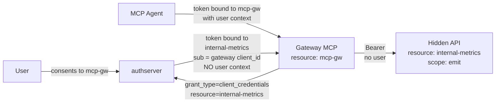
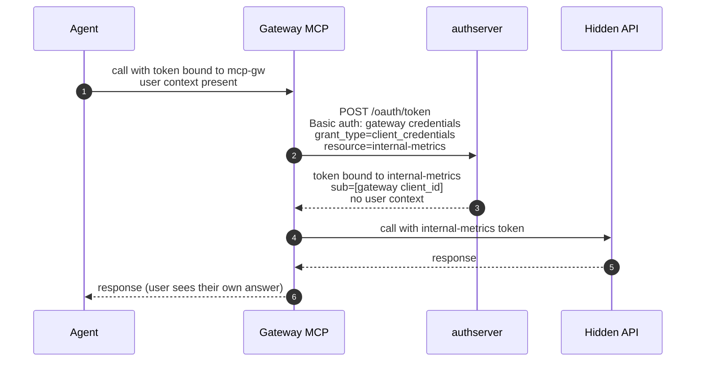

# Client-Credentials Hop

*Context: part of [Topologies](README.md). Start with the decision tree if you haven't.*

> **At a glance.** A user-facing MCP forwards to a hidden API by
> authenticating to it as itself, dropping user context on the second
> hop. Simplest way to encapsulate a hidden service when per-user audit
> on that hidden service does not matter. Shipped at v0.1.x (it's just
> the standard
> [client-credentials grant](../concepts/glossary.md#glossary-client-credentials-grant)
> used at runtime).

## Topology



The components:

- **Gateway** — registered both as a
  [Resource](../concepts/glossary.md#glossary-resource) (so the
  [agent](../concepts/glossary.md#glossary-agent) can authorize to it)
  **and** as a confidential OAuth client (so it can authenticate at
  `/oauth/token` for the second hop).
- **Hidden API** — its own
  [Mint Resource](../concepts/glossary.md#glossary-mint-backend).
  Receives a token whose `sub` is the gateway's `client_id`, never the
  user.
- **authserver** — the
  [Authorization Server](../concepts/glossary.md#glossary-authorization-server)
  issues two distinct
  [access tokens](../concepts/glossary.md#glossary-access-token) for
  the same logical request: one user-bound (for the gateway), one
  machine-bound (for the hidden API).

The user-bound token and the machine-bound token are entirely separate
issuances. The gateway is responsible for keeping its own `client_id`
and `client_secret` safe.

## Flow



The user identity is preserved on the **first** hop (agent → gateway)
and dropped on the **second** hop (gateway → hidden API).

## When to use

- The hidden API is unrelated infra — logging, billing aggregation,
  internal metrics emission — and per-user audit on *its* surface
  doesn't matter.
- You want minimum modeling cost: no fronting link, no token-exchange
  grant, no act-claim chain.

**Don't use when:**

- The hidden API does anything that should be auditable back to a real
  user → use [mcp-gateway-mint.md](mcp-gateway-mint.md). The fronted
  pattern preserves the user identity through `act.act.sub`.
- The hidden API is itself an upstream-IdP-backed service →
  [mcp-gateway-broker.md](mcp-gateway-broker.md).
- The hidden services are *truly* internal to the gateway with no
  independent surface → [folded-resource.md](folded-resource.md) is
  cheaper.

## How to configure

Two operations: (1) register the hidden API as a Mint Resource;
(2) register the gateway as a **confidential** OAuth client with the
`client_credentials` grant.

The gateway holds **two identities** at the AS — a Resource (`mcp-gw`,
which the agent's user-bound token is bound to) and an OAuth client
(which authenticates at `/oauth/token` for the second hop). The
gateway's own Resource registration is the [single-mcp.md](single-mcp.md)
shape and is not repeated here; this section configures only the
hidden-API piece and the gateway's *client* identity.

### Via Admin UI (`http://localhost:9001`)

1. Open **Resources** → **New resource**. Fill: slug
   `internal-metrics`, name `Internal Metrics`, backend kind `mint`,
   URI `https://metrics.internal`, scopes `emit`. Save.
2. Open **Clients** → **New client**. Fill: name `mcp-gw`, grant
   types `client_credentials`, token endpoint auth method
   `client_secret_basic`, scope `emit`. Save.
3. Copy the `client_id` and the one-time `client_secret`. Save them
   in the gateway's secret store.

### Via CLI

```bash
# 1. Register the hidden Resource
authserver admin resource create \
  --slug=internal-metrics \
  --backend-kind=mint \
  --uri=https://metrics.internal \
  --display-name="Internal Metrics" \
  --scopes='emit||Emit metrics'

# 2. Register the gateway as a confidential client
authserver admin client create \
  --name="mcp-gw" \
  --grant-types=client_credentials \
  --auth-method=client_secret_basic \
  --scope="emit"
```

### Via REST API

```bash
ADMIN=http://localhost:9001
KEY=dev-admin-key-localhost-only

# 1. Register the hidden Resource
curl -X POST "$ADMIN/admin/resources" \
  -H "Authorization: Bearer $KEY" \
  -H "Content-Type: application/json" \
  -d '{"slug":"internal-metrics",
       "display_name":"Internal Metrics",
       "backend_kind":"mint",
       "uri":"https://metrics.internal",
       "scopes":[{"name":"emit","description":"Emit metrics"}]}'

# 2. Register the gateway as a confidential client
curl -X POST "$ADMIN/admin/clients" \
  -H "Authorization: Bearer $KEY" \
  -H "Content-Type: application/json" \
  -d '{"client_name":"mcp-gw",
       "grant_types":["client_credentials"],
       "token_endpoint_auth_method":"client_secret_basic",
       "scope":"emit"}'
```

### Gateway dispatch at runtime

When the gateway calls the hidden API, it presents its own
credentials at `/oauth/token`:

```bash
curl -X POST http://localhost:9000/oauth/token \
  -u "<gateway_client_id>:<gateway_client_secret>" \
  -d "grant_type=client_credentials" \
  -d "resource=https://metrics.internal" \
  -d "scope=emit"
```

The returned token is sent to the hidden API on the next hop.

## How authserver handles it

The two hops are independent issuances:

| Hop | AS-side state |
|---|---|
| **Agent → Gateway** | Standard auth-code flow against `mcp-gw`. `consent_grants(user_id, client_id=agent, resource_id=mcp-gw)` row; `issuances(subject_user_id=<user>, client_id=agent, resource_id=mcp-gw)` row. |
| **Gateway → Hidden API** | `client_credentials` grant. `issuances(subject_user_id=<gateway client_id>, client_id=<gateway client_id>, resource_id=internal-metrics)` row (`subject_user_id = client_id` per RFC 9068 §2.2 for machine tokens; the table column is `NOT NULL`). **No `consent_grants` lookup** — there's no user on this hop. |

Audit-trace correlation across the two issuances is the operator's
problem (e.g. via a request ID propagated from agent through gateway
to hidden API). The AS does not record a chain link between them.

Tables touched: `resources`, `clients`, `consent_grants` (first hop
only), `issuances` (both hops), `audit_events`.

## Verify it

The two tokens look completely different. The user-bound token (first
hop):

```jsonc
{ "aud": ["https://mcp-gw.example.com"], "sub": "<user id>", ... }
```

The machine-bound token (second hop):

```jsonc
{ "aud": ["https://metrics.internal"],
  "sub": "<gateway client_id>",
  "client_id": "<gateway client_id>",
  ... }
```

Audit query — separate the two hops by `subject_user_id`:

```bash
sqlite3 data/authserver.db \
  "SELECT issued_at, client_id, resource_id, subject_user_id, scopes
   FROM issuances
   WHERE issued_at > datetime('now','-5 minutes')
   ORDER BY issued_at DESC;"
```

The hidden-API issuance has `subject_user_id = client_id` (RFC 9068
§2.2 — `sub = client_id` is the spec-level signal for a machine token
with no user context). The two hops differ on the equality
`subject_user_id = client_id`: true for the cc hop, false for the
user-bound hop.

## See also

- [m2m-client-credentials.md](m2m-client-credentials.md) — same grant,
  applied to a backend with **no upstream user** at all.
- [Client Credentials grant reference](../guides/integrate/client-credentials-grant.md).
- [mcp-gateway-mint.md](mcp-gateway-mint.md) — preserves user identity
  via the act-claim chain (Pattern 3 in the gateway family).
- [Glossary](../concepts/glossary.md) — Resource, Mint backend, agent, Authorization Server, access token, [scope](../concepts/glossary.md#glossary-scope), client-credentials grant.
