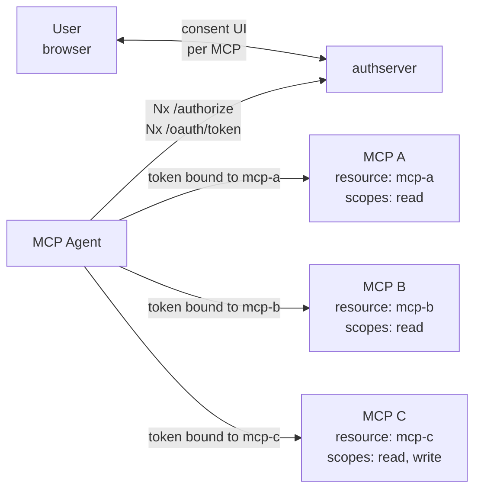
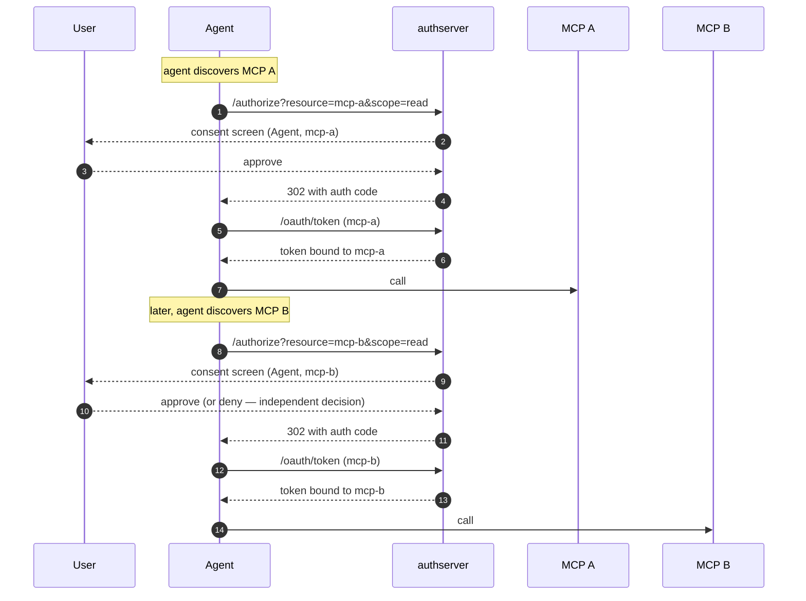

# Agent + Multiple MCPs (Direct Fanout)

*Context: part of [Topologies](README.md). Start with the decision tree if you haven't.*

> **At a glance.** One [agent](../concepts/glossary.md#glossary-agent)
> reaches multiple MCPs independently. The user
> [consents](../concepts/glossary.md#glossary-consent) at each MCP
> separately; the agent ends up with one
> [access token](../concepts/glossary.md#glossary-access-token) per MCP.
> Per-user audit. No encapsulation. Shipped at v0.1.x.

## Topology



The components:

- **Agent** — runs the auth-code flow once per MCP. Holds N tokens, one
  per Resource.
- **MCPs A, B, C** — independent
  [Mint Resources](../concepts/glossary.md#glossary-mint-backend). Each
  has its own [scope](../concepts/glossary.md#glossary-scope) catalog
  and its own consent decision.
- **authserver** — issues each token independently. The per-MCP consent
  gate enforces that a token bound to MCP A
  ([resource indicator](../concepts/glossary.md#glossary-resource-indicator))
  cannot be used (or
  [exchanged](../concepts/glossary.md#glossary-token-exchange)) for MCP
  B unless the user has separately consented at B.

## Flow



Each MCP is its own consent decision. The user can approve `mcp-a` and
deny `mcp-b` — the agent keeps a token for A and gets nothing for B.

## When to use

- The agent legitimately needs to reach multiple MCPs and the user
  understands and approves each one.
- Per-MCP consent is the right granularity (typically: yes — distinct
  MCPs do distinct things).
- No encapsulation requirement: it's fine for the agent to hold tokens
  for both MCPs.

**Don't use when:**

- You want to hide MCP B from the agent (agent should only see A) →
  use [mcp-gateway-mint.md](mcp-gateway-mint.md).
- The two MCPs are jointly meaningful and N consent screens feels
  arbitrary → use the (deferred) co-authorization variant tracked in
  [`README.md`](README.md#tracked--not-yet-shipped).
- You want a single consent that grants access to a *shared upstream*
  rather than two MCPs → that's [broker-mcp.md](broker-mcp.md), not
  fanout.

## How to configure

Two operations, repeated per MCP for the first one: (1) register every
MCP as its own Mint Resource; (2) register the agent as a single
public OAuth client with the union of scopes across all MCPs.

### Via Admin UI (`http://localhost:9001`)

1. Open **Resources** → **New resource**. Repeat once per MCP — for
   each: slug (`mcp-a`, `mcp-b`, `mcp-c`), backend kind `mint`, URI,
   scopes.
2. Open **Clients** → **New client**. Fill: name `my-agent`, grant
   types `authorization_code`, token endpoint auth method `none`,
   scope `read write` (the union across all MCPs). Save.

### Via CLI

```bash
# 1. Register every MCP
for slug in mcp-a mcp-b mcp-c; do
  authserver admin resource create \
    --slug="$slug" \
    --backend-kind=mint \
    --uri="https://$slug.example.com" \
    --display-name="$slug" \
    --scopes='read||Read access'
done

# 2. Register the agent (single client across all MCPs).
authserver admin client create \
  --name="my-agent" \
  --grant-types=authorization_code \
  --auth-method=none \
  --redirect-uris=https://my-agent.example.com/callback \
  --scope="read write"
```

### Via REST API

```bash
ADMIN=http://localhost:9001
KEY=dev-admin-key-localhost-only

# 1. Register every MCP
for slug in mcp-a mcp-b mcp-c; do
  curl -X POST "$ADMIN/admin/resources" \
    -H "Authorization: Bearer $KEY" \
    -H "Content-Type: application/json" \
    -d "{\"slug\":\"$slug\",
         \"display_name\":\"$slug\",
         \"backend_kind\":\"mint\",
         \"uri\":\"https://$slug.example.com\",
         \"scopes\":[{\"name\":\"read\",\"description\":\"Read access\"}]}"
done

# 2. Register the agent
curl -X POST "$ADMIN/admin/clients" \
  -H "Authorization: Bearer $KEY" \
  -H "Content-Type: application/json" \
  -d '{"client_name":"my-agent",
       "grant_types":["authorization_code"],
       "token_endpoint_auth_method":"none",
       "scope":"read write",
       "redirect_uris":["https://my-agent.example.com/callback"]}'
```

That's it. The agent runs OAuth discovery against each MCP and
follows N independent auth-code flows; the per-MCP consent gate
enforces the cross-MCP boundary at exchange time.

## How authserver handles it

| Phase | AS-side state |
|---|---|
| First MCP `/authorize` | Inserts `consent_grants(user_id, client_id=agent, resource_id=mcp-a)`. |
| First MCP `/oauth/token` | Issues JWT with `aud = resources.uri` (mcp-a). Inserts `issuances(subject_user_id, client_id, resource_id=mcp-a, scopes)`. |
| Second MCP `/authorize` | Inserts a **separate** `consent_grants(user_id, client_id=agent, resource_id=mcp-b)` row. |
| Cross-MCP exchange attempt | If the agent later tries to exchange an `mcp-a` token for an `mcp-b`-bound token, the per-MCP consent gate looks up `consent_grants(user_id, client_id=agent, resource_id=mcp-b)`. **Miss → `consent_required`** (denied with `reason=scope_not_consented` or `consent_required`). Hit → exchange succeeds. |

The cross-MCP exchange path is what the
[`TestCrossResourceExchange_ViaPerMCPConsent`](../../e2e/scenarios/cross_resource_per_mcp_consent_test.go)
e2e scenario covers — both the happy path (consent at both) and the
denial (consent at only one).

## Verify it

Confirm two distinct `consent_grants` rows exist:

```bash
sqlite3 data/authserver.db \
  "SELECT user_id, client_id, resource_id, scopes
   FROM consent_grants WHERE user_id = '<id>';"
```

Each token's `aud` claim should match exactly one MCP URI; tokens are
not interchangeable between MCPs.

## See also

- [single-mcp.md](single-mcp.md) — the building block this topology
  composes N times.
- [`TestCrossResourceExchange_ViaPerMCPConsent`](../../e2e/scenarios/cross_resource_per_mcp_consent_test.go) —
  e2e proof of the per-MCP consent gate.
- [Glossary](../concepts/glossary.md) — Resource, scope, consent, token exchange, resource indicator.
