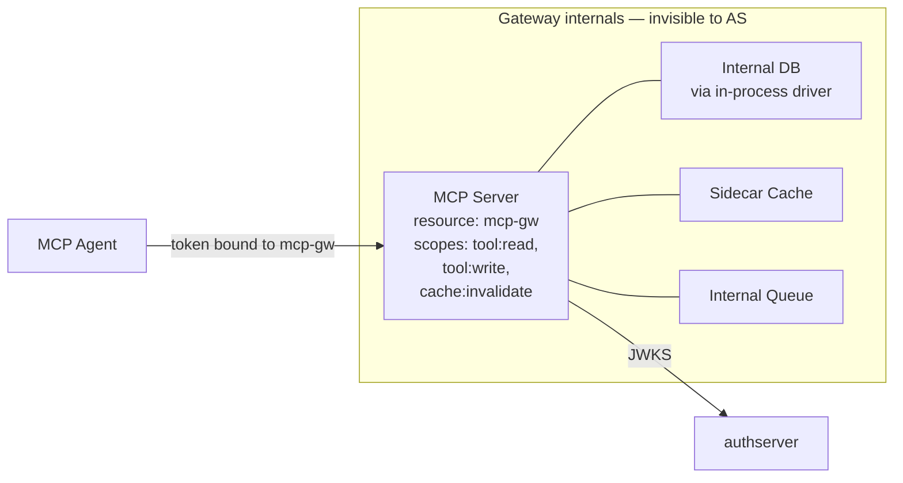
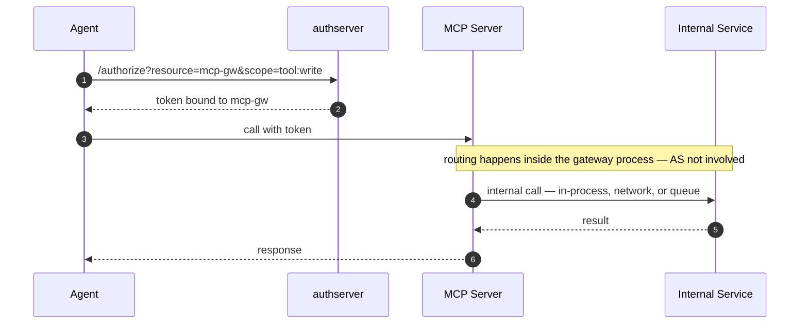

# Folded Resource (Internal Services Behind One MCP)

*Context: part of [Topologies](README.md). Start with the decision tree if you haven't.*

> **At a glance.** Multiple internal services hidden behind one
> [Resource](../concepts/glossary.md#glossary-resource) with a richer
> [scope](../concepts/glossary.md#glossary-scope) catalog. The "hidden"
> services become implementation details of the gateway and are never
> named at the
> [Authorization Server](../concepts/glossary.md#glossary-authorization-server).
> Per-user audit. Total encapsulation. Shipped at v0.1.x.

## Topology



The components:

- **MCP** — the only
  [Mint Resource](../concepts/glossary.md#glossary-mint-backend)
  registered at authserver. Its scope catalog spans every operation
  the [agent](../concepts/glossary.md#glossary-agent) will perform
  across the internal surface.
- **Internal services** — sidecars, databases, queues. They do not have
  their own Resource registrations. They are implementation, not
  surface.
- **authserver** — sees one Resource. No
  [fronting links](../concepts/glossary.md#glossary-fronting-link), no
  [token exchange](../concepts/glossary.md#glossary-token-exchange),
  no second-hop bookkeeping.

## Flow



After the agent gets a token, every internal hop is invisible to the
AS. The MCP authenticates to its sidecars however it likes (mTLS,
shared secret, in-process call) — that's an operator decision below
the OAuth boundary.

## When to use

- Internal services share an audience and lifecycle with the gateway.
- The hidden services have **no independent ownership** — same team,
  same deploy, same audit story.
- Modeling them as separate Resources would be ceremony with no
  observability gain.

**Don't use when:**

- The internal service has its own audit/ownership requirements that
  collapsing would erase → register it as a separate Resource and use
  [client-credentials-hop.md](client-credentials-hop.md) or
  [mcp-gateway-mint.md](mcp-gateway-mint.md).
- The internal service is reachable directly by other agents (it has a
  surface beyond this gateway) → it's not really internal; register
  it as its own Resource.

## How to configure

One Resource, one OAuth client — same shape as
[single-mcp.md](single-mcp.md), with a richer scope catalog. Internal
routing is the gateway's problem; authserver doesn't model it.

### Via Admin UI (`http://localhost:9001`)

1. Open **Resources** → **New resource**. Fill: slug `mcp-gw`, name
   `MCP Gateway`, backend kind `mint`, URI
   `https://mcp-gw.example.com`. Add the union of scopes:
   `tool:read`, `tool:write`, `cache:invalidate`. Save.
2. Open **Clients** → **New client**. Fill as in
   [single-mcp.md](single-mcp.md) Step 2 with scope
   `tool:read tool:write cache:invalidate`.

### Via CLI

```bash
authserver admin resource create \
  --slug=mcp-gw \
  --backend-kind=mint \
  --uri=https://mcp-gw.example.com \
  --display-name="MCP Gateway" \
  --scopes='tool:read||Read tools' \
  --scopes='tool:write||Write tools' \
  --scopes='cache:invalidate||Invalidate cache'

authserver admin client create \
  --name="my-agent" \
  --grant-types=authorization_code \
  --auth-method=none \
  --redirect-uris=https://my-agent.example.com/callback \
  --scope="tool:read tool:write cache:invalidate"
```

### Via REST API

```bash
ADMIN=http://localhost:9001
KEY=dev-admin-key-localhost-only

curl -X POST "$ADMIN/admin/resources" \
  -H "Authorization: Bearer $KEY" \
  -H "Content-Type: application/json" \
  -d '{"slug":"mcp-gw",
       "display_name":"MCP Gateway",
       "backend_kind":"mint",
       "uri":"https://mcp-gw.example.com",
       "scopes":[
         {"name":"tool:read","description":"Read tools"},
         {"name":"tool:write","description":"Write tools"},
         {"name":"cache:invalidate","description":"Invalidate cache"}
       ]}'

curl -X POST "$ADMIN/admin/clients" \
  -H "Authorization: Bearer $KEY" \
  -H "Content-Type: application/json" \
  -d '{"client_name":"my-agent",
       "grant_types":["authorization_code"],
       "token_endpoint_auth_method":"none",
       "scope":"tool:read tool:write cache:invalidate",
       "redirect_uris":["https://my-agent.example.com/callback"]}'
```

## How authserver handles it

This topology is identical to [single-mcp.md](single-mcp.md) from the
AS's perspective. The AS is unaware of the gateway's internals; it
only sees:

| Phase | AS-side state |
|---|---|
| `/authorize` + consent | One `consent_grants(user_id, client_id=agent, resource_id=mcp-gw)` row. |
| `/oauth/token` | One `issuances(subject_user_id, client_id, resource_id=mcp-gw, scopes)` row. The JWT `aud` claim is the joined `resources.uri`. |
| Token validation | One JWKS lookup from the gateway. |

Tables touched: `resources`, `clients`, `consent_grants`, `issuances`,
`audit_events`. Compare to the gateway patterns
([mcp-gateway-mint.md](mcp-gateway-mint.md),
[mcp-gateway-broker.md](mcp-gateway-broker.md)) where AS-side state
fans out across `fronting_links`, `broker_grants`, multi-row audit
chains.

## Verify it

The audit log shows a single Resource and a single issuance per agent
call. The `consent.granted` audit detail carries `resource=<slug>
scopes=...` (see `internal/services/consent.go`); the `token.issued`
detail is just `family=<id>` (see `internal/services/token.go`). Use
the consent event to scope the search, then join through `issuances`
on the same user to spot any other Resources that got hit:

```bash
# Consent rows for the folded gateway (resource=<slug> in detail).
sqlite3 data/authserver.db \
  "SELECT created_at, action, actor_id, detail FROM audit_events
   WHERE action = 'consent.granted'
     AND detail LIKE '%resource=mcp-gw%'
   ORDER BY created_at DESC LIMIT 5;"

# Issuances for the same user — every row should point at mcp-gw.
# If any issuance row references a different resource, the gateway
# is not actually folded (something internal got registered as a
# separate Resource).
sqlite3 data/authserver.db \
  "SELECT i.issued_at, r.slug AS resource_slug, i.client_id, i.scopes
   FROM issuances i
   JOIN resources r ON r.id = i.resource_id
   WHERE i.subject_user_id = '<user id>'
   ORDER BY i.issued_at DESC LIMIT 10;"
```

## See also

- [single-mcp.md](single-mcp.md) — same AS-side shape, different
  framing.
- [mcp-gateway-mint.md](mcp-gateway-mint.md) — when collapsing is
  wrong: the internal service has its own audit needs.
- [Glossary](../concepts/glossary.md) — Resource, Mint backend, scope, Authorization Server, agent, fronting link, token exchange.
