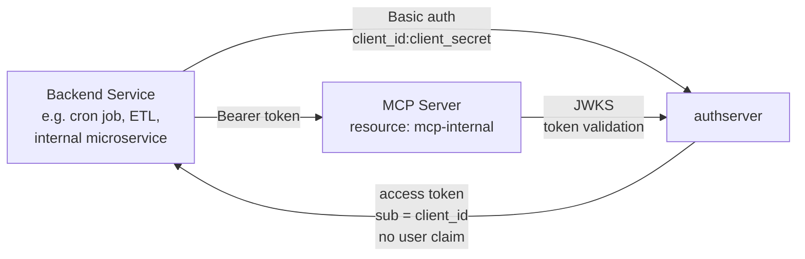
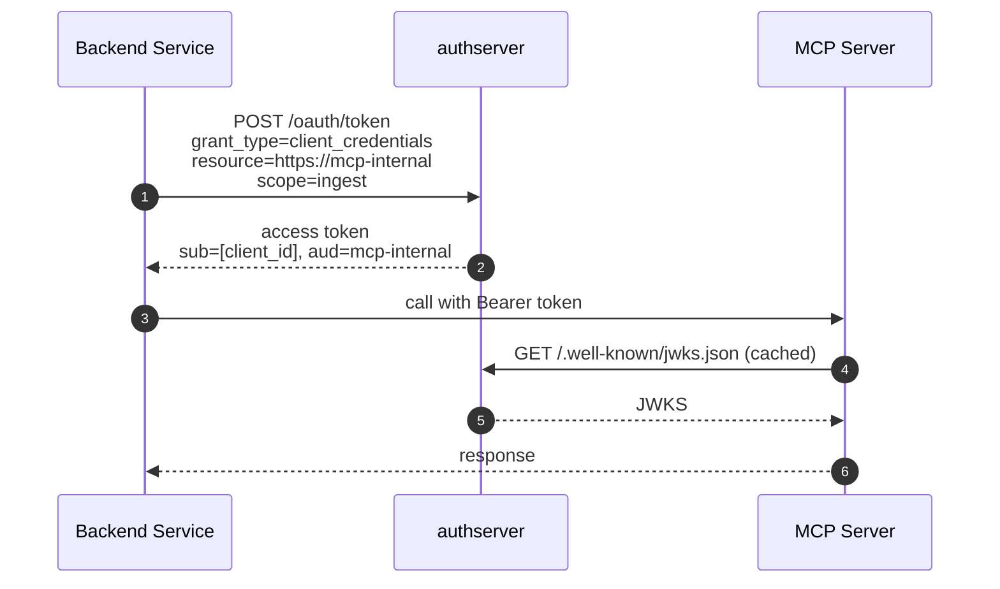

# Backend Service + MCP (no user)

*Context: part of [Topologies](README.md). Start with the decision tree if you haven't.*

> **At a glance.** Pure machine-to-machine. A backend service
> authenticates as itself, no human in the loop, no user identity in
> the issued token. Standard
> [OAuth 2.1](../concepts/glossary.md#glossary-oauth-2-1)
> [client-credentials grant](../concepts/glossary.md#glossary-client-credentials-grant).
> Shipped at v0.1.x.

## Topology



The components:

- **Backend** — a confidential OAuth client. Holds its own
  `client_id`/`client_secret`. No user is involved.
- **MCP** — an ordinary
  [Mint Resource](../concepts/glossary.md#glossary-mint-backend).
  Validates the [JWT](../concepts/glossary.md#glossary-jwt) exactly
  the same way as for user tokens; only the `sub` claim is different.
- **authserver** — the
  [Authorization Server](../concepts/glossary.md#glossary-authorization-server)
  issues the
  [access token](../concepts/glossary.md#glossary-access-token) via
  the client-credentials grant. No
  [consent](../concepts/glossary.md#glossary-consent) screen.

## Flow



There is no `/authorize` step and no consent screen — the backend is
authorizing itself by presenting credentials it already holds.

## When to use

- Backend service → MCP server, no user involved.
- Cron jobs, batch ETL, internal microservices, server-rendered tooling.
- Any flow where the backend's own identity is the right authorization
  subject.

**Don't use when:**

- The backend is acting on behalf of a real user → use
  [single-mcp.md](single-mcp.md) (auth code) or have the upstream pass
  through the user's bearer.
- The backend holds a user's bearer and forwards to a *second* hop with
  its own identity → that's
  [client-credentials-hop.md](client-credentials-hop.md), a distinct
  topology.

## How to configure

Two operations: (1) register the MCP as a Mint Resource;
(2) register the backend as a **confidential** OAuth client with the
`client_credentials` grant. Pick one mode and stay in it.

### Via Admin UI (`http://localhost:9001`)

1. Open **Resources** → **New resource**. Fill as in
   [single-mcp.md](single-mcp.md) with slug `mcp-internal`, scope
   `ingest`. Save.
2. Open **Clients** → **New client**. Fill: name `ingestor-cron`,
   grant types `client_credentials`, token endpoint auth method
   `client_secret_basic` (confidential), scope `ingest`. Save.
3. Copy both the `client_id` **and** the `client_secret` shown once on
   creation. Save them in the backend's secret store — the secret is
   never displayed again.

### Via CLI

```bash
# 1. Register the Resource
authserver admin resource create \
  --slug=mcp-internal \
  --backend-kind=mint \
  --uri=https://mcp-internal.example.com \
  --display-name="Internal MCP" \
  --scopes='ingest||Emit events'

# 2. Register the backend as a confidential client
authserver admin client create \
  --name="ingestor-cron" \
  --grant-types=client_credentials \
  --auth-method=client_secret_basic \
  --scope="ingest"
```

The second command prints the auto-generated `client_id` and the
plaintext `client_secret` once.

### Via REST API

```bash
ADMIN=http://localhost:9001
KEY=dev-admin-key-localhost-only

# 1. Register the Resource
curl -X POST "$ADMIN/admin/resources" \
  -H "Authorization: Bearer $KEY" \
  -H "Content-Type: application/json" \
  -d '{"slug":"mcp-internal",
       "display_name":"Internal MCP",
       "backend_kind":"mint",
       "uri":"https://mcp-internal.example.com",
       "scopes":[{"name":"ingest","description":"Emit events"}]}'

# 2. Register the backend as a confidential client
curl -X POST "$ADMIN/admin/clients" \
  -H "Authorization: Bearer $KEY" \
  -H "Content-Type: application/json" \
  -d '{"client_name":"ingestor-cron",
       "grant_types":["client_credentials"],
       "token_endpoint_auth_method":"client_secret_basic",
       "scope":"ingest"}'
```

The plaintext `client_secret` is in the response body — it's only
shown once.

### Backend usage at runtime

Regardless of the configuration mode you chose, the backend hits
`/oauth/token` the same way:

```bash
curl -X POST http://localhost:9000/oauth/token \
  -u "<client_id>:<client_secret>" \
  -d "grant_type=client_credentials" \
  -d "resource=https://mcp-internal.example.com" \
  -d "scope=ingest"
```

The response is a standard OAuth token response. Tokens are typically
short-lived; refresh tokens are not issued for `client_credentials`
(spec-compliant: just request a new one).

## How authserver handles it

| Phase | AS-side state |
|---|---|
| `/oauth/token` | Validates Basic-auth credentials against `clients.client_secret_hash`. Confirms the client has `client_credentials` in its grants list. |
| Authorization gate | Confirms the requested `scope` set is a subset of the client's allowed scopes. **No `consent_grants` lookup** — there's no user. |
| Token issuance | Mints a JWT with `sub = client_id`, `aud = resources.uri`. Inserts `issuances(subject_user_id=<client_id>, client_id=<client_id>, resource_id=<resource fk>, scopes=…)`. The `issuances.subject_user_id` column is `NOT NULL`; for machine tokens it holds the `client_id` (RFC 9068 §2.2 — `sub = client_id` for the no-user case), see `internal/services/client_credentials.go`. |
| Audit | `audit_events.action = client_credentials.issued` (NOT `token.issued` — `client_credentials.go` records `ActionClientCredentialsIssued`). No user actor. |

Tables touched: `resources`, `clients`, `issuances`, `audit_events`. No
`consent_grants`, no `broker_grants`.

## Verify it

The issued JWT carries no user identity:

```jsonc
{
  "iss":       "http://localhost:9000",
  "aud":       ["https://mcp-internal.example.com"],
  "client_id": "<generated client_id>",
  "sub":       "<generated client_id>",
  "scope":     "ingest"
}
```

`client_id` is the AS-generated OAuth client identifier
(`crypto.GenerateClientID()` — not the `--name=ingestor-cron` you passed in,
which is a human-readable label stored separately in `clients.name`).
`sub == client_id` is the RFC 9068 §2.2 signal that there's no user.
MCP servers that need to distinguish user tokens from m2m tokens
should check for `sub == client_id` (or for the absence of an
agent-identity claim, see
[Delegation and agent chains](../concepts/delegation-and-agent-chains.md)).

Audit query — m2m issuances surface under the
`client_credentials.issued` action; the matching `issuances` row has
`subject_user_id = client_id`:

```bash
# Find recent m2m audit events.
sqlite3 data/authserver.db \
  "SELECT created_at, actor_id, client_id, detail FROM audit_events
   WHERE action = 'client_credentials.issued'
   ORDER BY created_at DESC LIMIT 5;"

# Distinguish m2m issuances from user-bound ones on the issuances table
# directly (audit_events has no issuance_id column to join on).
sqlite3 data/authserver.db \
  "SELECT issued_at, client_id, resource_id, scopes
   FROM issuances
   WHERE subject_user_id = client_id
   ORDER BY issued_at DESC LIMIT 5;"
```

## See also

- [Client Credentials grant reference](../guides/integrate/client-credentials-grant.md) —
  full grant spec, error cases.
- [client-credentials-hop.md](client-credentials-hop.md) — the same
  grant used by a gateway to drop user context on a *second* hop.
- [Glossary](../concepts/glossary.md) — OAuth 2.1, client-credentials grant, access token, Mint backend, JWT, [scope](../concepts/glossary.md#glossary-scope), [audience](../concepts/glossary.md#glossary-audience).
