# MCP Gateway → Hidden Mint Resource

*Context: part of [Topologies](README.md). Start with the decision tree if you haven't.*

> **At a glance.** A gateway MCP fronts a hidden
> [Mint Resource](../concepts/glossary.md#glossary-mint-backend) via
> an operator-declared
> **[fronting link](../concepts/glossary.md#glossary-fronting-link)**.
> The [agent](../concepts/glossary.md#glossary-agent) never sees the
> hidden Resource. The token sent downstream is an AS-issued
> [JWT](../concepts/glossary.md#glossary-jwt) carrying an
> [act-claim](../concepts/glossary.md#glossary-act-claim)
> [chain](../concepts/glossary.md#glossary-agent-chain) that anchors
> the audit trail back to the agent. Per-user audit. Total
> encapsulation.

## Topology

```mermaid
flowchart LR
    User[User]
    Agent[MCP Agent]
    AS[authserver<br/>fronting_links:<br/>mcp-gw → rest-api<br/>scope_map A:AA, B:BB, C:CC]
    Gateway[Gateway MCP<br/>resource: mcp-gw<br/>scopes: A, B, C]
    Hidden[Hidden Mint Resource<br/>resource: rest-api<br/>scopes: AA, BB, CC]

    User -->|consents to mcp-gw only| AS
    Agent -->|token bound to mcp-gw| Gateway
    Gateway -->|RFC 8693 exchange<br/>subject_token = agent bearer<br/>resource = rest-api| AS
    AS -->|token bound to rest-api<br/>client_id = mcp-gw &#40;Option β&#41;<br/>act.act.sub = agent| Gateway
    Gateway -->|Bearer<br/>full audit chain on the wire| Hidden
```



The components:

- **Gateway MCP** — registered as a Mint Resource AND as a confidential
  OAuth client. The Resource is what the agent sees; the client is
  what the gateway uses to authenticate at `/oauth/token` for the
  exchange.
- **Hidden Mint Resource** — its own `backend_kind: mint` Resource. The
  agent never sees its
  [slug](../concepts/glossary.md#glossary-resource-slug), URI, or
  [scope](../concepts/glossary.md#glossary-scope) catalog.
- **Fronting link** — the AS-side declaration that says "the gateway
  is allowed to mint tokens to this hidden Resource on behalf of any
  authorized agent". Carries an explicit scope map.
- **authserver** — performs the
  [token exchange](../concepts/glossary.md#glossary-token-exchange)
  (RFC 8693), substitutes the source slug into `client_id` (Option β),
  and writes the chain into the issued JWT's `act` claims.

## Flow

```mermaid
sequenceDiagram
    autonumber
    participant Ag as Agent
    participant GW as Gateway &#40;mcp-gw&#41;
    participant AS as authserver
    participant API as Hidden REST API &#40;rest-api&#41;

    Ag->>GW: call with token bound to mcp-gw<br/>X-Requested-Scope: A
    GW->>AS: POST /oauth/token (RFC 8693)<br/>Basic auth (gateway creds)<br/>subject_token = agent bearer<br/>resource = rest-api<br/>scope = A
    Note over AS: lookup fronting_links<br/>(mcp-gw → rest-api)<br/>scope_map: A → AA<br/>Option β substitutes slug into client_id
    AS-->>GW: token bound to rest-api<br/>client_id=mcp-gw<br/>act.sub=mcp-gw<br/>act.act.sub=[agent]<br/>scope=AA
    GW->>API: call with downstream token
    API-->>GW: response
    GW-->>Ag: response
```



## Issued token shape (Option β)

```jsonc
{
  "iss":       "http://localhost:9000",
  "aud":       ["https://rest-api.example.com"],
  "client_id": "mcp-gw",          // source slug, NOT the gateway's OAuth client_id
  "scope":     "AA",
  "act": {
    "sub": "mcp-gw",              // immediate actor
    "act": {
      "sub": "<original agent>"   // chained back to the agent
    }
  }
}
```

The `act.act` chain anchors audit back to the agent even though the
gateway authenticated to `/oauth/token` as itself.

## When to use

- The agent must reach a hidden Mint Resource without ever seeing its
  URI, slug, or scope catalog (full encapsulation).
- Per-user audit must survive the second hop — the act-claim chain in
  the issued JWT carries it.
- The hidden Resource is also AS-managed (not an upstream IdP).

**Don't use when:**

- The hidden Resource is backed by an upstream IdP →
  [mcp-gateway-broker.md](mcp-gateway-broker.md).
- The hidden API is unrelated infra and per-user audit doesn't matter
  → [client-credentials-hop.md](client-credentials-hop.md) is simpler.
- The hidden services are truly internal to the gateway →
  [folded-resource.md](folded-resource.md).

## How to configure

Three operations: (1) register both Resources (Mint); (2) create the
fronting link; (3) register the gateway as a confidential client with
the `client_credentials` and token-exchange grants.

The `scope_map` is the source-to-target translation: an agent
presenting an `mcp-gw` token with scope `A` may obtain a downstream
`rest-api` token carrying scope `AA`.

### Via Admin UI (`http://localhost:9001`)

1. Open **Resources** → **New resource**. Create `mcp-gw` (Mint, URI
   `https://mcp-gw.example.com`, scopes `A`, `B`, `C`). Save.
2. Same page, **New resource** again. Create `rest-api` (Mint, URI
   `https://rest-api.example.com`, scopes `AA`, `BB`, `CC`). Save.
3. Open **Fronting** → **New link**. Source `mcp-gw`, target
   `rest-api`. Add scope-map rows `A → AA`, `B → BB`, `C → CC`. Save.
4. Open **Clients** → **New client**. Fill: name `mcp-gw`, grant
   types `client_credentials,urn:ietf:params:oauth:grant-type:token-exchange`,
   auth method `client_secret_basic`, scope `A B C`. Save the
   `client_id` + `client_secret` for the gateway config.

### Via CLI

```bash
# 1. Register both Resources
authserver admin resource create \
  --slug=mcp-gw \
  --backend-kind=mint \
  --uri=https://mcp-gw.example.com \
  --display-name="MCP Gateway" \
  --scopes='A||Scope A' --scopes='B||Scope B' --scopes='C||Scope C'

authserver admin resource create \
  --slug=rest-api \
  --backend-kind=mint \
  --uri=https://rest-api.example.com \
  --display-name="Hidden REST API" \
  --scopes='AA||Scope AA' --scopes='BB||Scope BB' --scopes='CC||Scope CC'

# 2. Create the fronting link
authserver admin fronting create \
  --source=mcp-gw \
  --target=rest-api \
  --scope-map='A:AA,B:BB,C:CC'

# 3. Register the gateway as a confidential client
authserver admin client create \
  --name="mcp-gw" \
  --grant-types=client_credentials,urn:ietf:params:oauth:grant-type:token-exchange \
  --auth-method=client_secret_basic \
  --scope="A B C"
```

### Via REST API

```bash
ADMIN=http://localhost:9001
KEY=dev-admin-key-localhost-only

# 1. Register both Resources
curl -X POST "$ADMIN/admin/resources" \
  -H "Authorization: Bearer $KEY" -H "Content-Type: application/json" \
  -d '{"slug":"mcp-gw","display_name":"MCP Gateway",
       "backend_kind":"mint","uri":"https://mcp-gw.example.com",
       "scopes":[{"name":"A"},{"name":"B"},{"name":"C"}]}'

curl -X POST "$ADMIN/admin/resources" \
  -H "Authorization: Bearer $KEY" -H "Content-Type: application/json" \
  -d '{"slug":"rest-api","display_name":"Hidden REST API",
       "backend_kind":"mint","uri":"https://rest-api.example.com",
       "scopes":[{"name":"AA"},{"name":"BB"},{"name":"CC"}]}'

# 2. Create the fronting link
curl -X POST "$ADMIN/admin/fronting" \
  -H "Authorization: Bearer $KEY" -H "Content-Type: application/json" \
  -d '{"source":"mcp-gw","target":"rest-api",
       "scope_map":{"A":["AA"],"B":["BB"],"C":["CC"]}}'

# 3. Register the gateway as a confidential client
curl -X POST "$ADMIN/admin/clients" \
  -H "Authorization: Bearer $KEY" -H "Content-Type: application/json" \
  -d '{"client_name":"mcp-gw",
       "grant_types":["client_credentials","urn:ietf:params:oauth:grant-type:token-exchange"],
       "token_endpoint_auth_method":"client_secret_basic",
       "scope":"A B C"}'
```

### Run the gateway

A ready-to-run dedicated gateway example is not shipped today; build
the inbound HTTP shape (`X-Requested-Scope` header), the
`act`-claim-aware token-exchange wiring, and the per-scope policy
yourself using the [Token Exchange grant guide](../guides/upstream-providers/token-exchange-grant.md)
and the [tier-04 broker-upstream example](../../examples/typescript/04-broker-upstream/)
as references.

## How authserver handles it

The exchange is orchestrated by `TokenExchangeService` and goes through
these AS-side steps:

| Step | AS-side action |
|---|---|
| Authenticate caller | Validates Basic-auth credentials → resolves the gateway's `client_id`. |
| Resolve `subject_token` | Decodes the agent's bearer; pulls out `aud` (= `mcp-gw` URI) and `sub` (= agent identity). |
| Per-MCP consent gate | Looks up `consent_grants(user_id, client_id=agent, resource_id=mcp-gw)`. Required — the agent must have user consent at the *source* MCP. |
| Fronting-link gate | Looks up `fronting_links(source_slug=mcp-gw, target_slug=rest-api)`. Hit → fronted path. Miss → falls back to the cross-MCP consent path (which would also require `consent_grants` for `rest-api` and is **not** what this topology configures). |
| Scope translation | Applies `fronting_links.scope_map`: `A → AA`. |
| Option β substitution | Sets `client_id = source.slug` (= `"mcp-gw"`) on the issued JWT — not the gateway's auto-generated OAuth `client_id`. Builds the `act.sub = mcp-gw, act.act.sub = <agent>` chain. |
| Issue + audit | Inserts `issuances(subject_user_id, client_id, resource_id=rest-api, scopes, agent_id, agent_chain)`. `audit_events` action `token.exchanged`; `detail` carries `type=mint_dispatch chain_kind=fronted via_link=mcp-gw->rest-api` (mint dispatch is identified by `type=mint_dispatch` — the emit does not carry a `target_kind=` field). |

Tables touched: `resources`, `clients`, `fronting_links`,
`consent_grants` (lookup only), `issuances`, `audit_events`. **No**
`broker_grants` involvement (target is Mint).

### About `client_id` in the issued token

The `client_id` claim is the **source resource's slug** (`mcp-gw`),
not the gateway's auto-generated OAuth `client_id`. Slug and OAuth
`client_id` are decoupled — `client_id` is auto-generated and opaque,
`slug` is operator-meaningful. **You do not need to satisfy any "slug
equals client_id" relationship to use a fronting link** — Option β
substitutes the slug at dispatch time regardless of the gateway's
OAuth credentials.

### When you also need `policy.runtime.client_ids`

`runtime.client_ids` is **only** required when the gateway dispatches
to a *Broker* Resource on a path that is **not** covered by a fronting
link — the broker agent-attestation gate. For Mint→Mint dispatches
like this topology, the runtime agent-attestation gate does not run.

If the same gateway also dispatches directly to a Broker Resource
without a fronting link, you do need `runtime.client_ids` configured
for *that* other path. See
[runtime-client-binding.md](../guides/integrate/runtime-client-binding.md).

## Verify it

Decode the downstream token (e.g. with `jwt.io`) and confirm the
`act.act.sub` chain matches the agent. Audit query:

```bash
sqlite3 data/authserver.db \
  "SELECT created_at, actor_id, action, detail FROM audit_events
   WHERE action = 'token.exchanged'
     AND detail LIKE '%type=mint_dispatch%'
     AND detail LIKE '%chain_kind=fronted%'
   ORDER BY created_at DESC LIMIT 5;"
```

`detail` carries `type=mint_dispatch chain_kind=fronted
via_link=mcp-gw->rest-api`. Mint dispatch does not include a
`target_kind=` field — `type=mint_dispatch` alone identifies the path.

## See also

- [mcp-gateway-broker.md](mcp-gateway-broker.md) — sibling pattern for
  Broker targets.
- [Token Exchange grant recipe](../guides/upstream-providers/token-exchange-grant.md).
- [runtime-client-binding.md](../guides/integrate/runtime-client-binding.md) — only
  needed for non-fronted broker dispatch.
- [Glossary](../concepts/glossary.md) — Mint backend, fronting link, agent, JWT, act claim, agent chain, resource slug, scope, token exchange.
