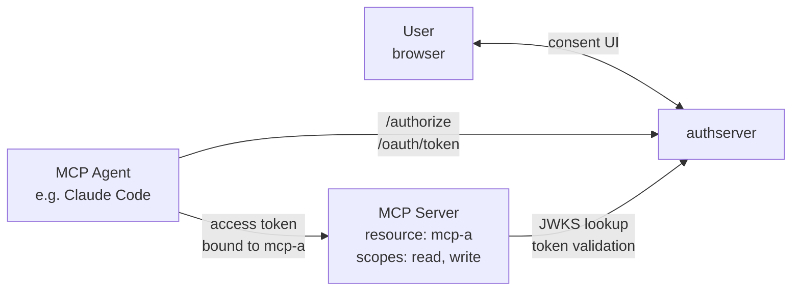
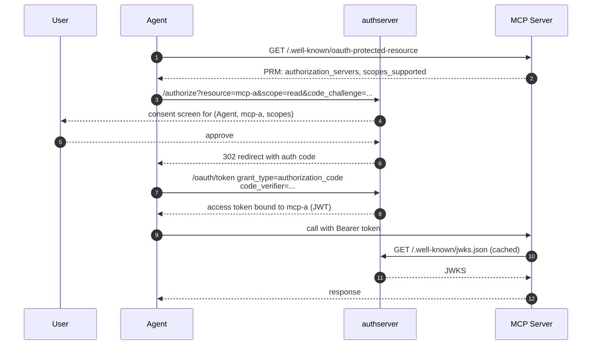

# Agent + Single MCP

*Context: part of [Topologies](README.md). Start with the decision tree if you haven't.*

> **At a glance.** One [agent](../concepts/glossary.md#glossary-agent),
> one MCP, one user — the canonical baseline every other topology
> builds on.
> [OAuth 2.1](../concepts/glossary.md#glossary-oauth-2-1)
> authorization-code flow with
> [PKCE](../concepts/glossary.md#glossary-pkce).
> Per-user audit. No encapsulation needed (no second hop). Shipped at
> v0.1.x.

## Topology



The four components:

- **User** — provides [consent](../concepts/glossary.md#glossary-consent) at the AS via their browser.
- **Agent** — runs the OAuth client. Holds the user's bearer token.
- **authserver** — issues the
  [JWT](../concepts/glossary.md#glossary-jwt), signs with its own key
  (the [Mint backend](../concepts/glossary.md#glossary-mint-backend) in
  `backend_kind: mint`).
- **MCP server** — the [Resource](../concepts/glossary.md#glossary-resource).
  Validates the JWT against authserver's
  [JWKS](../concepts/glossary.md#glossary-jwks) on every call.

## Flow



## When to use

- A single-purpose MCP server with its own scope catalog.
- The agent only needs to reach this one MCP for the user.
- Per-MCP, per-agent consent is acceptable (typically the right default).

**Don't use when:**

- The agent must reach multiple MCPs without separate per-MCP consent
  → use [direct-fanout.md](direct-fanout.md) or
  [mcp-gateway-mint.md](mcp-gateway-mint.md).
- The MCP wraps an upstream IdP (Google, GitHub, …) → use
  [broker-mcp.md](broker-mcp.md).
- There is no user (machine-to-machine only) → use
  [m2m-client-credentials.md](m2m-client-credentials.md).

## How to configure

You can configure this topology three equivalent ways — pick one and
stay in it for the whole walkthrough. All three paths end with the
same AS-side state.

The two operations are: (1) register the MCP as a Mint Resource;
(2) register the agent as a public OAuth client. The Resource's `uri`
must match, byte-for-byte, the `resource` field your MCP server
returns from
[`/.well-known/oauth-protected-resource`](../concepts/glossary.md#glossary-protected-resource-metadata)
— see [connect-mcp-server.md](../guides/integrate/connect-mcp-server.md).

### Via Admin UI (`http://localhost:9001`)

1. Open **Resources** → **New resource**. Fill: slug `mcp-a`, name
   `MCP A`, backend kind `mint`, URI `https://mcp-a.example.com`. Add
   scopes `read` and `write`. Save.
2. Open **Clients** → **New client**. Fill: name `my-agent`, grant
   types `authorization_code`, token endpoint auth method `none`
   (public client), scope `read write`. Save.
3. Copy the auto-generated `client_id` from the Clients list and hand
   it to the agent. PKCE is enforced for **all** clients on the
   authorization-code flow (`authorize.go:110-115` rejects a missing
   `code_challenge` regardless of `token_endpoint_auth_method`); the
   `auth-method=none` choice above just declares the client public —
   it does not change the PKCE requirement.

### Via CLI

```bash
# 1. Register the Resource
authserver admin resource create \
  --slug=mcp-a \
  --backend-kind=mint \
  --uri=https://mcp-a.example.com \
  --display-name="MCP A" \
  --scopes='read||Read access' \
  --scopes='write||Write access'

# 2. Register the agent (public client; auth-method=none means PKCE-only).
#    --redirect-uris is required for the authorization_code grant — /authorize
#    rejects any redirect_uri that doesn't exact-match a registered entry
#    (loopback redirects ignore the port per RFC 8252 §7.3).
authserver admin client create \
  --name="my-agent" \
  --grant-types=authorization_code \
  --auth-method=none \
  --redirect-uris=https://my-agent.example.com/callback \
  --scope="read write"
```

The `--scopes` flag is repeatable; each value is `name|upstream|description`
(upstream empty for Mint). The `client create` output prints the
auto-generated `client_id`.

### Via REST API

```bash
ADMIN=http://localhost:9001
KEY=dev-admin-key-localhost-only

# 1. Register the Resource
curl -X POST "$ADMIN/admin/resources" \
  -H "Authorization: Bearer $KEY" \
  -H "Content-Type: application/json" \
  -d '{"slug":"mcp-a",
       "display_name":"MCP A",
       "backend_kind":"mint",
       "uri":"https://mcp-a.example.com",
       "scopes":[
         {"name":"read","description":"Read access"},
         {"name":"write","description":"Write access"}
       ]}'

# 2. Register the agent (token_endpoint_auth_method=none = public + PKCE)
curl -X POST "$ADMIN/admin/clients" \
  -H "Authorization: Bearer $KEY" \
  -H "Content-Type: application/json" \
  -d '{"client_name":"my-agent",
       "grant_types":["authorization_code"],
       "token_endpoint_auth_method":"none",
       "scope":"read write",
       "redirect_uris":["https://my-agent.example.com/callback"]}'
```

The `client_id` is in the response body of the second call.

## How authserver handles it

| Step | AS-side state |
|---|---|
| `/authorize` discovery | Validates `resource` param against `resources.uri` (Mint). |
| User consent | Inserts/updates `consent_grants(user_id, client_id, resource_id, scopes)` with the agreed scope set. Audit row: `action=consent.granted`. |
| Auth-code exchange | Validates PKCE; reads `consent_grants` row for the (user, agent, mcp-a) tuple; emits a JWT signed by the active key. |
| Token issuance | Inserts `issuances(subject_user_id, client_id, resource_id, scopes, agent_id, agent_chain)`. The audience claim on the JWT is the joined `resources.uri`. Audit row: `action=token.issued`. |
| MCP-side validation | Reads `/.well-known/jwks.json` (cached); validates `iss`, `aud`, `exp`, `scope`. |

Tables touched: `resources`, `clients`, `consent_grants`, `issuances`,
`audit_events`. No `broker_grants` or `broker_providers` involvement
— this is a Mint-only flow.

## Verify it

Decode the issued JWT (e.g. with `jwt.io`) and confirm:

```jsonc
{
  "iss":       "http://localhost:9000",
  "aud":       ["https://mcp-a.example.com"],
  "client_id": "<agent client_id>",
  "scope":     "read write",
  "sub":       "<user id>"
}
```

`aud` is serialized as a JSON array even when there is exactly one audience
(`AccessTokenClaims.Audience` is `[]string` per RFC 7519 §4.1.3 — the AS
binds each token to a single resource per RFC 8707).

Inspect the audit log:

```bash
sqlite3 data/authserver.db \
  "SELECT created_at, actor_id, action, detail FROM audit_events
   WHERE action IN ('consent.granted','token.issued')
   ORDER BY created_at DESC LIMIT 10;"
```

## See also

- [Connect an MCP Server](../guides/integrate/connect-mcp-server.md) — MCP-side
  PRM + JWT validation setup.
- [Authentication Flows](../reference/flows.md) — auth-code flow
  reference, every parameter and error code.
- [Token Design](../guides/operate/token-design-internals.md) — JWT format,
  key rotation, refresh-token semantics.
- [Glossary](../concepts/glossary.md) — Resource, Mint backend, [scope](../concepts/glossary.md#glossary-scope), [audience](../concepts/glossary.md#glossary-audience), JWT, JWKS, PKCE.
